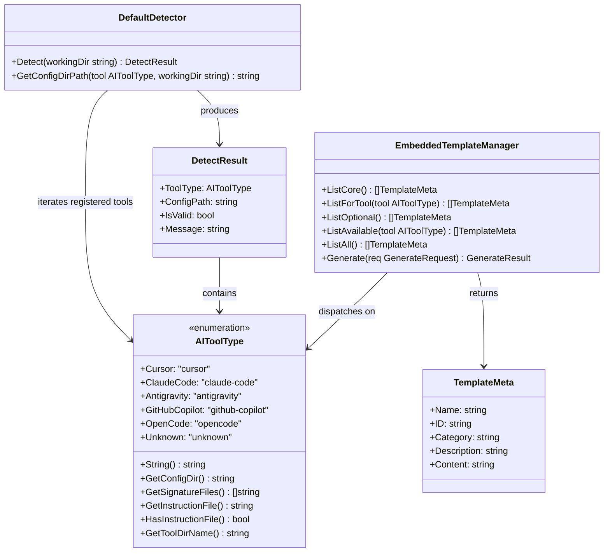

# Add OpenCode AI Tool Support to openspdd CLI

## Requirements

Extend openspdd's tool-aware machinery so the CLI recognizes `opencode` (the OpenCode AI coding tool from `opencode.ai`) as a first-class target alongside Cursor, Claude Code, Antigravity, and GitHub Copilot. Users running openspdd inside an OpenCode-managed project must be able to detect that environment automatically, list available templates for it, and generate SPDD command markdown files into the project-local `.opencode/commands/` directory — both via auto-detection and via the explicit `--tool opencode` flag — without any change to existing tool behavior.

## Entities



Conservative entity note: `AIToolType`, `DetectResult`, `DefaultDetector`, `EmbeddedTemplateManager`, and `TemplateMeta` already exist verbatim. The only entity-level change is appending the `OpenCode` constant to the existing `AIToolType` typed-string enum. No new structs, no DTOs, no refactor, no signature changes on the existing methods.

## Approach

1. **Enum Extension Strategy**:
   - Append `OpenCode AIToolType = "opencode"` to the existing constant block in `internal/detector/types.go` after `GitHubCopilot`.
   - Extend each of the six per-method switches (`String`, `GetConfigDir`, `GetSignatureFiles`, `GetInstructionFile`, `HasInstructionFile`, `GetToolDirName`) with a new `case OpenCode` arm.
   - Map `OpenCode` to: human name `"OpenCode"`, config dir `.opencode/commands`, signatures `[".opencode", "opencode.json"]`, no instruction file (returns `""` and `false`), tool dir name `"opencode"`.

2. **Detector Registration**:
   - Append `OpenCode` to the tail of the `toolTypes` slice in `internal/detector/detector.go::Detect()`.
   - Tail position guarantees zero regression for existing detections — Cursor / Claude Code / Antigravity / Copilot continue to win first-match against any project that has both their signature and an OpenCode signature.

3. **Template Manager Registration**:
   - Append `detector.OpenCode` to the `knownTools` slice in `internal/templates/manager.go::ListAll()` so any future per-tool templates under `data/tools/opencode/` surface in the all-templates listing.
   - No new code path is required: `ListForTool(OpenCode)` is already covered by `loadTemplatesFromDir("data/tools/opencode")`, which returns an empty slice when the directory is absent from the embedded FS (the same gracefully-missing path used today for `cursor/`, `claude-code/`, `antigravity/`).

4. **CLI Surface Wiring**:
   - Add `case "opencode":` to `cmd/root.go::ParseToolFlag()` returning `detector.OpenCode`. Canonical flag value only; no aliases (consistent with `cursor`, `antigravity`).
   - Add `huh.NewOption("OpenCode", "opencode")` as the fifth (final) entry in the picker options slice in `cmd/init.go::selectToolInteractively()`. Tail position preserves muscle memory of existing users.

5. **Documentation Synchronization**:
   - Update `README.md` in three sections: the "Cross-platform" bullet (line 86), the `--tool` examples (lines 243–245), and the detection/output table (lines 252–255) — adding a row for OpenCode with signatures `.opencode/`, `opencode.json` and config dir `.opencode/commands/`.
   - Mirror the same three updates in `README.zh-CN.md`.
   - Update the long-help string in `cmd/root.go::rootCmd.Long` (line 28) to include "OpenCode" in the supported environments list.
   - Update the `--tool` flag help text in `cmd/root.go` (line 52) to include `opencode` in the parenthetical accepted-values list.

6. **Test Coverage Strategy**:
   - Extend the six existing table-driven tests in `tests/detector/types_test.go` with one row per test for `OpenCode` (`String`, `GetConfigDir`, `GetSignatureFiles`, `GetInstructionFile`, `HasInstructionFile`, `GetToolDirName`).
   - Add a detection test in `tests/detector/detector_test.go` covering both signature paths (`.opencode/` directory and `opencode.json` file) using `t.TempDir()` fixtures.
   - Add at least one `ParseToolFlag` test row in the existing `tests/cmd/root_test.go` table (assert `"opencode"` → `detector.OpenCode`).

7. **Risk Assessment**:
   - Drift risk across ~10 enumeration sites is the only meaningful technical risk. Mitigated by the explicit, ordered Operations checklist below — every site is enumerated and verified by tests.
   - No external dependencies, no new code paths in the embedded-template path (the `Copilot` instruction-file branch is untouched), no behavior change for non-OpenCode tools.

## Structure

### Inheritance Relationships

1. `OpenCode` is a typed-string constant of `AIToolType` (existing typed string). No struct, no interface implementation; it participates in the enum solely through method-switch dispatch on `AIToolType`.
2. No new interfaces and no new struct hierarchies are introduced.

### Dependencies

1. `cmd/root.go::ParseToolFlag` depends on the `detector.OpenCode` constant (new symbol).
2. `cmd/init.go::selectToolInteractively` depends on the `huh` library (already vendored) and on the `detector.OpenCode` constant (new symbol via the `"opencode"` huh option value).
3. `internal/detector/detector.go::Detect` depends on `OpenCode.GetSignatureFiles()` returning the new signature list.
4. `internal/templates/manager.go::ListAll` depends on `OpenCode.GetToolDirName()` returning `"opencode"` so `loadTemplatesFromDir("data/tools/opencode")` can be invoked (returns empty when the dir is absent from `embedded.FS`).
5. `tests/detector/types_test.go` depends on `detector.OpenCode` for table-row coverage; same for `tests/detector/detector_test.go` and `tests/cmd/root_test.go`.
6. No external module dependencies are added; `go.mod` is unchanged.

### Layered Architecture

1. **Detector Layer (`internal/detector`)**: owns the `AIToolType` enum, signature detection, and tool-dir naming. Source of truth for tool identity. Touched files: `types.go`, `detector.go`.
2. **Template Layer (`internal/templates`)**: enumerates known tools for `ListAll` aggregation. Touched files: `manager.go` (one slice extension).
3. **CLI Layer (`cmd`)**: exposes the tool surface to users via flag parsing, interactive picker, and long-help text. Touched files: `root.go`, `init.go`.
4. **Embedded Asset Layer (`internal/templates/data/tools/`)**: per-tool asset directories. No file change required for OpenCode (graceful missing-dir handling in `loadTemplatesFromDir`).
5. **Documentation Layer**: `README.md`, `README.zh-CN.md`. User-facing parity surface.
6. **Test Layer (`tests/`)**: enforces the contract. Touched files: `tests/detector/types_test.go`, `tests/detector/detector_test.go`, `tests/cmd/root_test.go` (if a `ParseToolFlag` table exists; otherwise add a new test function).

## Operations

> **Execution order**: Operations 1 → 2 are both prerequisite for Operations 3 / 4 / 5 (everything imports `detector.OpenCode`). Operations 3, 4, and 5 are independent of one another and may proceed in any order. Operation 6 (documentation) is independent of code but should be completed before merging. Operation 7 (tests) MUST be completed and passing before the change is considered done.

### 1. Update `AIToolType` enum and per-method switches — `internal/detector/types.go`

1. Responsibility: introduce the `OpenCode` enum value and extend every `switch t` block so OpenCode behaves identically to other "flat-markdown-commands" tools.
2. Changes (apply all in this single file):
   - **Constant block**: append `OpenCode AIToolType = "opencode"` after the `GitHubCopilot` constant, before `Unknown`.
   - **`String()`**: add `case OpenCode: return "OpenCode"` before `default`.
   - **`GetConfigDir()`**: add `case OpenCode: return ".opencode/commands"` before `default`.
   - **`GetSignatureFiles()`**: add `case OpenCode: return []string{".opencode", "opencode.json"}` before `default`.
   - **`GetInstructionFile()`**: no new case required; OpenCode falls through to `default` returning `""`. (Verify `default` still returns `""` — it does today.)
   - **`HasInstructionFile()`**: no change required; the function returns `t == GitHubCopilot`. OpenCode evaluates to `false` automatically. Do NOT widen this predicate.
   - **`GetToolDirName()`**: add `case OpenCode: return "opencode"` before `default`.
3. Constraints:
   - Constant string value MUST be exactly `"opencode"` (lowercase, single word).
   - Human-readable string MUST be exactly `"OpenCode"` (no space, capital O and C — matches the brand spelling).
   - Config dir MUST be exactly `.opencode/commands` (no leading or trailing slash).
   - Signature list MUST be exactly `[".opencode", "opencode.json"]` (this exact slice; the order does not matter functionally but the documented order is `.opencode` first, `opencode.json` second).
   - The `Unknown` constant MUST remain the last value in the constant block.
4. Verification: `go build ./...` succeeds; existing tests still pass.

### 2. Register OpenCode in detector iteration order — `internal/detector/detector.go`

1. Responsibility: make `Detect()` actually look for OpenCode signatures.
2. Change: in `(*DefaultDetector).Detect`, modify the `toolTypes` slice declaration:
   - Before: `toolTypes := []AIToolType{Cursor, ClaudeCode, Antigravity, GitHubCopilot}`
   - After:  `toolTypes := []AIToolType{Cursor, ClaudeCode, Antigravity, GitHubCopilot, OpenCode}`
3. Constraints:
   - OpenCode MUST be appended at the end (tail position). Do NOT reorder existing entries.
   - No other change in this file.
4. Verification: with a working dir containing `.opencode/`, `Detect()` returns a `DetectResult` with `ToolType == OpenCode`, `IsValid == true`, and `ConfigPath` ending in `.opencode/commands`.

### 3. Register OpenCode in template-manager known-tools list — `internal/templates/manager.go`

1. Responsibility: ensure `ListAll()` does not silently omit any future per-tool template under `data/tools/opencode/`.
2. Change: in `(*EmbeddedTemplateManager).ListAll`, modify the `knownTools` slice:
   - Before: `knownTools := []detector.AIToolType{detector.Cursor, detector.ClaudeCode, detector.Antigravity, detector.GitHubCopilot}`
   - After:  `knownTools := []detector.AIToolType{detector.Cursor, detector.ClaudeCode, detector.Antigravity, detector.GitHubCopilot, detector.OpenCode}`
3. Constraints:
   - OpenCode MUST be appended at the end. Do NOT reorder.
   - Do NOT touch `GenerateForCopilot`. The Copilot-specific code path is unrelated to OpenCode.
   - Do NOT create `internal/templates/data/tools/opencode/`. The directory's absence is handled by `loadTemplatesFromDir` (returns empty slice on `fs.ReadDir` error).
4. Verification: `openspdd list --all` (or the equivalent test) still succeeds with no panic and no behavior change for the existing four tools' templates.

### 4. Add OpenCode to CLI flag parser — `cmd/root.go`

1. Responsibility: accept `--tool opencode` and translate it to the `OpenCode` enum value.
2. Changes:
   - **`ParseToolFlag` switch**: add a new `case "opencode": return detector.OpenCode` arm. Place it after the `github-copilot` arm and before `default`.
   - **`rootCmd.Long`**: extend the existing sentence "Supports Cursor, Claude Code, Antigravity, and GitHub Copilot environments." to "Supports Cursor, Claude Code, Antigravity, GitHub Copilot, and OpenCode environments." Preserve the rest of the long-help verbatim.
   - **Persistent-flag help text**: in the `init()` function, update the `--tool` help string from `"Manually specify tool type (cursor, claude-code, antigravity, github-copilot)"` to `"Manually specify tool type (cursor, claude-code, antigravity, github-copilot, opencode)"`.
3. Constraints:
   - Canonical flag value MUST be `"opencode"` (lowercase). Do NOT add aliases (`oc`, `open-code`) in this change.
   - Do NOT reorder the existing `case` arms in `ParseToolFlag`.
   - The function MUST still default to `detector.Unknown` for any unrecognized input.
4. Verification: `openspdd --tool opencode init` (in a directory without any signature) creates `.opencode/commands/`; `openspdd --tool opencode generate spdd-analysis` writes the file under `.opencode/commands/spdd-analysis.md`.

### 5. Add OpenCode to interactive picker — `cmd/init.go`

1. Responsibility: surface OpenCode in the `huh` picker shown when `init` runs without a detected environment.
2. Change: in `selectToolInteractively`, append a new option to the `options` slice:
   - Before: four `huh.NewOption(...)` entries ending with `huh.NewOption("GitHub Copilot", "github-copilot")`.
   - After:  five entries with `huh.NewOption("OpenCode", "opencode")` appended last.
3. Constraints:
   - Display label MUST be exactly `"OpenCode"`.
   - Option value MUST be exactly `"opencode"` so the existing `ParseToolFlag(selected)` call resolves it correctly.
   - Do NOT reorder the existing four entries.
4. Verification: running `openspdd init` in a directory with no signature files presents a picker with five options; selecting `OpenCode` leads to creation of `.opencode/commands/`.

### 6. Update user-facing documentation — `README.md` and `README.zh-CN.md`

1. Responsibility: keep the published supported-tools surface in sync with the code.
2. Changes (apply identically in both READMEs, translating prose where appropriate):
   - **Cross-platform bullet** (currently `- **Cross-platform**: Supports Cursor, Claude Code, GitHub Copilot, and Antigravity`): change to `- **Cross-platform**: Supports Cursor, Claude Code, GitHub Copilot, Antigravity, and OpenCode`.
   - **`--tool` examples block** (currently three lines `openspdd --tool claude-code <command>` / `antigravity` / `github-copilot`): append a fourth line `openspdd --tool opencode <command>`.
   - **Detection/config table**: append a new row:
     ```
     | OpenCode       | `.opencode/`, `opencode.json`                                 | `.opencode/commands/`      |
     ```
     The row goes between the `Antigravity` row and the `GitHub Copilot` row to mirror the human-name alphabetical / brand-grouped order, OR appended after `GitHub Copilot` (pick one and apply consistently in both files; recommended: append after `GitHub Copilot` to mirror the detection iteration order in code).
3. Constraints:
   - Apply the exact same set of changes to both `README.md` and `README.zh-CN.md`.
   - Translate the cross-platform bullet's prose verbatim into Chinese parity ("跨平台支持 Cursor、Claude Code、GitHub Copilot、Antigravity 和 OpenCode" or equivalent matching the existing zh-CN phrasing).
   - Do NOT modify any other line; the change is purely additive.
4. Verification: a diff of `README.md` shows three localized hunks (one per surface); `README.zh-CN.md` shows the equivalent three localized hunks.

### 7. Extend tests — `tests/detector/types_test.go`, `tests/detector/detector_test.go`, `tests/cmd/root_test.go`

1. Responsibility: lock the new contract and exercise the new detection signature paths.
2. Changes:
   - **`tests/detector/types_test.go`** (six existing table-driven tests): add one row per test case table for `detector.OpenCode`:
     - `TestAIToolType_String`: `{toolType: detector.OpenCode, want: "OpenCode"}`
     - `TestAIToolType_GetConfigDir`: `{toolType: detector.OpenCode, want: ".opencode/commands"}`
     - `TestAIToolType_GetSignatureFiles`: `{toolType: detector.OpenCode, want: []string{".opencode", "opencode.json"}}`
     - `TestAIToolType_GetInstructionFile`: `{toolType: detector.OpenCode, want: ""}`
     - `TestAIToolType_HasInstructionFile`: `{toolType: detector.OpenCode, want: false}`
     - `TestAIToolType_GetToolDirName`: `{toolType: detector.OpenCode, want: "opencode"}`
     Each row's `name` field follows the existing convention: `"OpenCode <method-being-tested>"`.
   - **`tests/detector/detector_test.go`**: add at least two new sub-tests using the existing `t.TempDir()` + `os.MkdirAll` / `os.WriteFile` pattern (mirror existing Cursor/Claude tests):
     - One sub-test creates `<tmp>/.opencode/` directory and asserts `Detect(tmpDir)` returns `ToolType == detector.OpenCode`, `IsValid == true`, and `ConfigPath == filepath.Join(tmpDir, ".opencode/commands")`.
     - One sub-test creates `<tmp>/opencode.json` (empty file is sufficient) and asserts the same outcome.
   - **`tests/cmd/root_test.go`**: if a `TestParseToolFlag` table-driven test exists, add a row `{flag: "opencode", want: detector.OpenCode}`. If no such test exists, add a new test function `TestParseToolFlag_OpenCode` covering this single mapping.
3. Constraints:
   - Tests MUST follow the existing table-driven and naming conventions in the same file. Do NOT introduce a different testing style.
   - All new tests MUST pass with `go test ./...`.
   - Existing test outputs MUST remain unchanged.
4. Verification: `go test ./...` exits 0; the new tests are visible in test output and pass.

## Norms

1. **Enum-extension pattern**: when adding a new tool to `AIToolType`, every `switch t` block that has a non-trivial `default` arm MUST get a new `case` arm placed BEFORE the `default`. Tools whose behavior is exactly `default` (e.g., `HasInstructionFile`'s `t == GitHubCopilot` predicate, where every non-Copilot tool is `false`) MUST NOT be widened — fall-through to `default` is the correct expression of "behaves like the other flat-markdown tools".
2. **Constant ordering**: `Unknown` is always the last constant in the `AIToolType` block. New tool constants are appended immediately before `Unknown`, never after.
3. **Detection iteration order**: new tools are appended at the tail of the `toolTypes` slice in `Detect()`. This preserves first-match disambiguation for projects that already match an earlier tool.
4. **Tool flag values**: canonical `--tool` values are lowercase, brand-faithful (`cursor`, `claude-code`, `antigravity`, `github-copilot`, `opencode`). Aliases are added only when justified by user demand; the default is no alias.
5. **Picker option ordering**: `huh.NewOption` entries in `selectToolInteractively` follow the same order as the `toolTypes` slice in the detector. New tools are appended to the tail.
6. **Tool dir naming**: `GetToolDirName()` returns the lowercase, single-token (or hyphen-separated for multi-word) directory name under `internal/templates/data/tools/`. The value MUST match what users see in `--tool` (canonical flag value).
7. **Empty tool dir convention**: tools with no bespoke assets do NOT require a corresponding directory in `internal/templates/data/tools/`. `loadTemplatesFromDir` handles the missing-dir case by returning an empty slice. Do NOT add a placeholder file just for embedding — `go:embed all:data` plus the missing-dir-tolerant loader are sufficient.
8. **No instruction-file branch unless the tool truly needs one**: only `GitHubCopilot` triggers `GenerateForCopilot` today via the `HasInstructionFile() == true` branch. New tools default to `false` (the function returns `t == GitHubCopilot`). Adding a new instruction-file branch is a separate design exercise and is NOT done as part of an enum-extension change.
9. **Test-table parity**: every `AIToolType` method that has a table-driven test in `tests/detector/types_test.go` MUST receive a new row for every new constant added to the enum. This is non-negotiable: the table is the contract.
10. **Documentation parity**: any change to the supported-tools surface MUST update `README.md`, `README.zh-CN.md`, and the long-help / flag-help strings in `cmd/root.go` in the same change. The user-facing surface and the code surface MUST stay in sync within a single commit.
11. **Go style**: standard Go formatting (`gofmt`), no `interface{}`/`any` introduced, no panics, no `fmt.Errorf` rewriting in unchanged code paths. Existing error-handling style in each file is preserved.
12. **Comment style**: in line with the project rule of avoiding narration comments, no new comments are added except where they explain non-obvious intent (e.g., why OpenCode is appended last, if reviewers might otherwise reorder).

## Safeguards

1. **Functional Constraints**:
   - `OpenCode.GetConfigDir()` MUST return exactly `.opencode/commands` — no leading slash, no trailing slash, no platform-specific separator. The path is joined with the working directory by `filepath.Join` in `GetConfigDirPath`, which handles separator normalization.
   - `Detect(workingDir)` in a directory containing `.opencode/` MUST return `ToolType == OpenCode` and `IsValid == true`.
   - `Detect(workingDir)` in a directory containing only `opencode.json` (no `.opencode/`) MUST also return `ToolType == OpenCode` and `IsValid == true`.
   - `Detect(workingDir)` in a directory containing both `.cursor/` and `.opencode/` MUST return `ToolType == Cursor` (existing first-match behavior preserved).
   - `ParseToolFlag("opencode")` MUST return `detector.OpenCode`. `ParseToolFlag("OpenCode")` MUST also return `detector.OpenCode` (the function lowercases its input via `strings.ToLower`).
   - `ParseToolFlag("oc")` and `ParseToolFlag("open-code")` MUST return `detector.Unknown` (no aliases in this change).
   - `openspdd --tool opencode generate <template>` MUST write the file to `<workingDir>/.opencode/commands/<template>.md`.

2. **Backward Compatibility Constraints**:
   - All existing public symbols (`detector.Cursor`, `detector.ClaudeCode`, `detector.Antigravity`, `detector.GitHubCopilot`, `detector.Unknown`, all method signatures on `AIToolType`, `DefaultDetector.Detect`, `EmbeddedTemplateManager` methods, `cmd.ParseToolFlag`) MUST retain their current types and behavior.
   - The string values of existing constants MUST NOT change.
   - The order of existing entries in `toolTypes`, `knownTools`, and the picker `options` slice MUST NOT change.
   - All existing tests MUST continue to pass without modification.

3. **Detection Safety Constraints**:
   - The detector MUST NOT write to the filesystem. The new signature checks (`os.Stat(".opencode")`, `os.Stat("opencode.json")`) are read-only — preserve this.
   - The detector MUST NOT recurse outside the working directory. Both signatures are project-root-relative.
   - The detector MUST NOT panic on permission errors; `os.Stat` returns an error which the existing loop ignores by design.

4. **Non-goals (explicitly out of scope)**:
   - OpenCode `AGENTS.md` (project-level instruction file) generation: NOT implemented in this change. `HasInstructionFile()` returns `false` for OpenCode.
   - Per-tool helper templates under `internal/templates/data/tools/opencode/`: NOT created; the directory is intentionally absent (graceful missing-dir handling).
   - Aliases for the `--tool` flag (`oc`, `open-code`): NOT added.
   - Refactoring the `AIToolType` enum into a registry/plugin model: NOT done; the closed enum is preserved.
   - Introducing a `GenerateForOpenCode` code path or generalizing `GenerateForCopilot`: NOT done.
   - OpenCode-specific frontmatter rewriting in core templates: NOT done; existing frontmatter is compatible (OpenCode ignores unknown keys per its docs).

5. **Test Constraints**:
   - Every new row in the table-driven tests MUST follow the existing struct shape and naming convention in the same file.
   - Detection tests MUST use `t.TempDir()` (no test pollution of the working directory).
   - Tests MUST NOT depend on network access, environment variables, or actual OpenCode installation.
   - The CI test command (`go test ./...`) MUST exit 0 after the change.

6. **Documentation Constraints**:
   - `README.md` and `README.zh-CN.md` MUST be updated in the same commit as the code change.
   - The Chinese README's prose MUST be a faithful translation of the English changes — no scope drift between languages.
   - The supported-tools table row order MUST be consistent across both READMEs (recommendation: append OpenCode after GitHub Copilot in both, mirroring detection iteration order).

7. **Build & CI Constraints**:
   - `go build ./...` MUST succeed.
   - `go vet ./...` MUST report no new issues.
   - `gofmt -l .` MUST report no formatting deltas.
   - `go test ./...` MUST pass on macOS and Linux (existing matrix). No new dependency is added; `go.mod` and `go.sum` MUST be unchanged.

8. **File-touch Discipline**:
   - The complete list of files modified by this change MUST be exactly:
     1. `internal/detector/types.go` (enum + six per-method switches)
     2. `internal/detector/detector.go` (one slice extension)
     3. `internal/templates/manager.go` (one slice extension in `ListAll`)
     4. `cmd/root.go` (`ParseToolFlag` + long-help + flag-help)
     5. `cmd/init.go` (one picker option)
     6. `README.md` (three sections)
     7. `README.zh-CN.md` (three sections, Chinese parity)
     8. `tests/detector/types_test.go` (six new table rows)
     9. `tests/detector/detector_test.go` (two new sub-tests)
     10. `tests/cmd/root_test.go` (one new row or new test function for `ParseToolFlag`)
   - Any other file change indicates scope creep and MUST be reviewed.
