# Add Codex Skills Support to OpenSPDD via a Strategy-Pattern Refactor of Template Generation

## Requirements

Extend openspdd to recognize OpenAI Codex as a first-class AI tool target whose SPDD command set is generated as project-scoped skill bundles under `<repo>/.agents/skills/<id>/SKILL.md` (the directory Codex natively scans), while simultaneously refactoring the existing two-archetype generation dispatch (`if ToolType == GitHubCopilot { ... } else { ... }`) into a tool-agnostic `GenerationStrategy` interface backed by a self-registering `init()` registry — so that adding Codex (and any future tool with a new archetype) becomes a single-file change without touching `cmd/generate.go` or any existing strategy.

## Entities

```mermaid
classDiagram
direction TB

class AIToolType {
    <<enumeration>>
    +Cursor: "cursor"
    +ClaudeCode: "claude-code"
    +Antigravity: "antigravity"
    +GitHubCopilot: "github-copilot"
    +OpenCode: "opencode"
    +Codex: "codex"
    +Unknown: "unknown"
    +String() string
    +GetConfigDir() string
    +GetSignatureFiles() []string
    +GetInstructionFile() string
    +HasInstructionFile() bool
    +GetToolDirName() string
}

class DetectResult {
    +ToolType: AIToolType
    +ConfigPath: string
    +IsValid: bool
    +Message: string
}

class DefaultDetector {
    +Detect(workingDir string) DetectResult
    +GetConfigDirPath(tool AIToolType, workingDir string) string
}

class TemplateManager {
    <<interface>>
    +ListCore() []TemplateMeta
    +ListForTool(tool AIToolType) []TemplateMeta
    +ListOptional() []TemplateMeta
    +ListAvailable(tool AIToolType) []TemplateMeta
    +ListAll() []TemplateMeta
    +GetByName(name string) TemplateMeta
    +Generate(req GenerateRequest) GenerateResult
}

class EmbeddedTemplateManager {
    +ListCore() []TemplateMeta
    +ListForTool(tool AIToolType) []TemplateMeta
    +ListOptional() []TemplateMeta
    +ListAvailable(tool AIToolType) []TemplateMeta
    +ListAll() []TemplateMeta
    +GetByName(name string) TemplateMeta
    +Generate(req GenerateRequest) GenerateResult
}

class TemplateMeta {
    +Name: string
    +ID: string
    +Category: string
    +Description: string
    +Content: string
}

class GenerationStrategy {
    <<interface>>
    +GenerateAll(workingDir string, force bool) []GenerateResult
    +GenerateOne(workingDir string, tmpl TemplateMeta, force bool) []GenerateResult
}

class FlatMarkdownStrategy {
    -tool: AIToolType
    -manager: *EmbeddedTemplateManager
    +GenerateAll(workingDir string, force bool) []GenerateResult
    +GenerateOne(workingDir string, tmpl TemplateMeta, force bool) []GenerateResult
}

class CopilotInstructionFileStrategy {
    -manager: *EmbeddedTemplateManager
    +GenerateAll(workingDir string, force bool) []GenerateResult
    +GenerateOne(workingDir string, tmpl TemplateMeta, force bool) []GenerateResult
}

class CodexSkillStrategy {
    -manager: *EmbeddedTemplateManager
    +GenerateAll(workingDir string, force bool) []GenerateResult
    +GenerateOne(workingDir string, tmpl TemplateMeta, force bool) []GenerateResult
}

class CodexHelpers {
    <<package-level helpers>>
    +buildSkillMd(meta TemplateMeta) []byte
    +buildOpenAIYaml(allowImplicit bool) []byte
    +stripFrontmatter(content string) string
    +escapeYAMLScalar(s string) string
    +writeSkillFile(path string, content []byte, force bool) GenerateResult
}

class AllowImplicitInvocation {
    <<package-level var>>
    +AllowImplicitInvocation: bool
}

class strategyRegistry {
    <<package-level map>>
    -entries: map[AIToolType]strategyFactory
    +RegisterStrategy(tool AIToolType, factory strategyFactory)
    +StrategyFor(tool AIToolType, mgr *EmbeddedTemplateManager) GenerationStrategy
}

EmbeddedTemplateManager ..|> TemplateManager : implements
FlatMarkdownStrategy ..|> GenerationStrategy : implements
CopilotInstructionFileStrategy ..|> GenerationStrategy : implements
CodexSkillStrategy ..|> GenerationStrategy : implements
strategyRegistry --> GenerationStrategy : returns
strategyRegistry --> AIToolType : keyed by
FlatMarkdownStrategy --> EmbeddedTemplateManager : delegates list/load to
CopilotInstructionFileStrategy --> EmbeddedTemplateManager : delegates list/load to
CodexSkillStrategy --> EmbeddedTemplateManager : delegates list/load to
CodexSkillStrategy --> CodexHelpers : uses
CodexSkillStrategy --> AllowImplicitInvocation : reads
DefaultDetector --> AIToolType : iterates registered tools
DefaultDetector --> DetectResult : produces
DetectResult --> AIToolType : contains
EmbeddedTemplateManager --> TemplateMeta : returns
```



Conservative entity note:
- `AIToolType`, `DetectResult`, `DefaultDetector`, `TemplateMeta`, `EmbeddedTemplateManager` already exist verbatim. The only enum-level change is appending the `Codex` constant.
- `TemplateManager` interface loses the `GenerateForCopilot(targetDir, force)` method (a Copilot-specific leak). `EmbeddedTemplateManager` loses the same method (its body is migrated into `CopilotInstructionFileStrategy`, not deleted).
- `GenerationStrategy`, `FlatMarkdownStrategy`, `CopilotInstructionFileStrategy`, `CodexSkillStrategy`, and the package-level `strategyRegistry` are NEW.
- The `GenerationStrategy` interface defines TWO methods: `GenerateAll` (used by `--all`) and `GenerateOne` (used by single-template + interactive paths). Both are required of every strategy. `GenerateOne` returns a slice because some archetypes (e.g., Codex skills) emit multiple files per template (`SKILL.md` + `agents/openai.yaml`).
- Codex helpers (`buildSkillMd`, `buildOpenAIYaml`, `stripFrontmatter`, `escapeYAMLScalar`, `writeSkillFile`) live as unexported package-level functions in `codex_strategy.go`, NOT as methods on `CodexSkillStrategy`. The Codex implicit-invocation knob is the package-level variable `templates.AllowImplicitInvocation` (set by the CLI from `--allow-implicit`), NOT a struct field.
- No new DTOs, no refactor of `Generate(req)` (which remains the low-level single-file primitive used by the flat strategy), no signature changes on detector or template-manager methods other than the `GenerateForCopilot` removal.

## Approach

1. **Strategy abstraction & registry (Step 1, pure refactor)**:
   - Introduce `GenerationStrategy` interface in `internal/templates/strategy.go` with TWO methods:
     - `GenerateAll(workingDir string, force bool) []GenerateResult` — used by `openspdd generate --all`.
     - `GenerateOne(workingDir string, tmpl TemplateMeta, force bool) []GenerateResult` — used by `openspdd generate <name>` and the interactive picker. Returns a slice because some archetypes (e.g., Codex) emit multiple files per template.
   - Introduce a package-level `map[detector.AIToolType]strategyFactory` plus `RegisterStrategy(tool, factory)` and `StrategyFor(tool, mgr)` helpers in the same file. Lookup falls back to `FlatMarkdownStrategy` for unregistered tools.
   - Each non-default strategy lives in its own file (`flat_strategy.go`, `copilot_strategy.go`, future `codex_strategy.go`); each registers itself in its own `init()` (except `FlatMarkdownStrategy`, which is the explicit fallback constructed inside `StrategyFor`).
   - This is **pure refactor with zero behavior change**: the existing Copilot test suite is the regression contract. Internally, every strategy's `GenerateAll` is implemented as a loop over `GenerateOne`, keeping behavior between the bulk and per-template paths trivially consistent.

2. **Copilot migration (Step 1, completes the refactor)**:
   - Move the body of `EmbeddedTemplateManager.GenerateForCopilot(targetDir, force)` verbatim into `CopilotInstructionFileStrategy.GenerateAll(workingDir, force)`.
   - Delete `GenerateForCopilot` from the `TemplateManager` interface AND from `EmbeddedTemplateManager`. Workspace search confirms zero in-repo callers outside `cmd/generate.go::generateAllTemplates` and the test file `tests/templates/manager_test.go`.
   - Update the existing 6 `TestEmbeddedTemplateManager_GenerateForCopilot_*` tests in `tests/templates/manager_test.go` so the **invocation line** (`manager.GenerateForCopilot(...)`) becomes `templates.StrategyFor(detector.GitHubCopilot, manager).GenerateAll(...)`. **All assertions remain byte-identical.**
   - Replace the `if detectedResult.ToolType == detector.GitHubCopilot { ... } else { ... }` branch in `cmd/generate.go::generateAllTemplates` with a single dispatch line: `results := templates.StrategyFor(detectedResult.ToolType, templateManager).GenerateAll(workingDir, forceFlag)`. The result-rendering loop afterward stays the same.

3. **Codex tool registration (Step 2, additive)**:
   - Append `Codex AIToolType = "codex"` to the constant block in `internal/detector/types.go` (before `Unknown`).
   - Extend the 6 per-method switches with a `case Codex` arm where needed: `String() → "Codex"`, `GetConfigDir() → ".agents/skills"`, `GetSignatureFiles() → []string{".codex", ".codex/config.toml"}`, `GetToolDirName() → "codex"`. `GetInstructionFile()` and `HasInstructionFile()` need no new arm (Codex falls through to the default → `""` and `false`).
   - Append `Codex` at the tail of the `toolTypes` slice in `internal/detector/detector.go::Detect`.
   - Append `detector.Codex` to the `knownTools` slice in `internal/templates/manager.go::ListAll`.
   - Add `case "codex": return detector.Codex` to `cmd/root.go::ParseToolFlag`. Update the `--tool` help string and `rootCmd.Long` text to include `codex` / "Codex".
   - Append `huh.NewOption("Codex", "codex")` as the last picker option in `cmd/init.go::selectToolInteractively`.

4. **Codex skill generation (Step 2, additive)**:
   - Implement `CodexSkillStrategy.GenerateOne(workingDir, tmpl, force)` in `internal/templates/codex_strategy.go` as the per-template primitive:
     - Compute `skillDir := filepath.Join(workingDir, ".agents", "skills", tmpl.ID)` and `os.MkdirAll(skillDir, 0755)`.
     - Generate `SKILL.md` inside the directory: hand-craft frontmatter as `---\nname: <id-stripped-of-leading-slash>\ndescription: <description>\n---\n\n<original-body>` (drop OpenSPDD's `id` and `category` keys; strip any leading `/` from `name`).
     - Generate sibling `agents/openai.yaml` with `policy.allow_implicit_invocation: false` (unless `templates.AllowImplicitInvocation` is `true`; v1 default is `false`).
     - Honor `force` flag with the same skip-existing semantics as `Generate(req)`. Skip-existing is applied per file independently.
   - Implement `CodexSkillStrategy.GenerateAll(workingDir, force)` as a thin loop:
     - Call `manager.ListAvailable(detector.Codex)` (Codex has no per-tool templates, so this reduces to the core set; optional templates are intentionally excluded from `--all` to mirror the existing UX for every other tool).
     - For each template, append `s.GenerateOne(workingDir, tmpl, force)...` to the results slice.
   - Register the strategy in an `init()` block in the same file: `RegisterStrategy(detector.Codex, func(mgr *EmbeddedTemplateManager) GenerationStrategy { return &CodexSkillStrategy{manager: mgr} })`.
   - Add `--allow-implicit` flag to `cmd/generate.go` (default `false`); plumb it into the strategy via the package-level variable `templates.AllowImplicitInvocation`, set in BOTH `generateAllTemplates` AND `generateOneViaStrategy` immediately before strategy dispatch. This keeps the `GenerationStrategy` interface tool-agnostic and avoids per-strategy options structs in v1.
   - The transformation logic is fully encapsulated inside `CodexSkillStrategy` and its package-level helpers (`buildSkillMd`, `buildOpenAIYaml`, `stripFrontmatter`, `escapeYAMLScalar`, `writeSkillFile`); no Codex-specific code leaks into `cmd/`, the manager interface, or core templates.

5. **Detector signature for Codex (Step 2, additive)**:
   - Use `[".codex", ".codex/config.toml"]` as Codex signatures. These are Codex-exclusive markers (project-level Codex config location).
   - **Explicitly do NOT** add `.agents/skills/` (cross-vendor open standard; would mis-detect any agentic project) or `AGENTS.md` (cross-vendor; used by Claude Code and others).
   - `Codex` is appended at the tail of `toolTypes` in `Detect()` — preserves first-match precedence for every existing supported tool.

6. **Test coverage (Step 1 + Step 2)**:
   - Step 1: existing Copilot tests in `tests/templates/manager_test.go` are updated to invoke through `StrategyFor` instead of `GenerateForCopilot`; assertions unchanged. Add a new `tests/templates/strategy_test.go` covering: (a) `StrategyFor(GitHubCopilot)` returns `*CopilotInstructionFileStrategy`, (b) `StrategyFor(Cursor)` returns `*FlatMarkdownStrategy`, (c) `StrategyFor` for an unregistered fake tool falls back to `FlatMarkdownStrategy`, (d) registry contains exactly the expected non-default tools after package init.
   - Step 2: extend the 6 table-driven tests in `tests/detector/types_test.go` with `Codex` rows. Add detection sub-tests in `tests/detector/detector_test.go` for both signatures (`.codex/` and `.codex/config.toml`) plus a mixed-tool precedence test (e.g., `.cursor/` + `.codex/` resolves to `Cursor`). Add a `ParseToolFlag("codex") → detector.Codex` row in `tests/cmd/root_test.go`. Add a new `tests/templates/codex_strategy_test.go` covering: directory layout, frontmatter transformation correctness (strip `/`, drop `id`/`category`, preserve `description`, valid YAML output), `agents/openai.yaml` content (`allow_implicit_invocation: false` by default, `true` when `--allow-implicit` is set), skip-existing semantics, force-overwrite semantics.

7. **Documentation parity (Step 2)**:
   - Update both `README.md` and `README.zh-CN.md` in three sections each: cross-platform bullet, `--tool` examples, supported-environment table (new Codex row with signatures `.codex/`, `.codex/config.toml` and config dir `.agents/skills/`).
   - Add a one-paragraph note in both READMEs explaining: (a) Codex uses skills, not flat commands; (b) invocation in Codex is `$spdd-*` or via `/skills`, not `/spdd-*`; (c) `.agents/skills/` is a cross-vendor open standard directory; (d) the Codex trust-model gotcha (project must be marked trusted in Codex config for skills to load on some Codex versions).
   - Update `cmd/root.go::rootCmd.Long` and the `--tool` flag-help string to include Codex.

## Structure

### Inheritance Relationships

1. `Codex` is a new typed-string constant of `AIToolType` (existing typed string). No struct, no interface implementation; it participates in the enum via method-switch dispatch on `AIToolType` exactly like the other 5 tools.
2. `GenerationStrategy` is a new tool-agnostic interface in `internal/templates/`. It defines two methods: `GenerateAll(workingDir string, force bool) []GenerateResult` (bulk path used by `--all`) and `GenerateOne(workingDir string, tmpl TemplateMeta, force bool) []GenerateResult` (per-template path used by single-template + interactive generation). Every concrete strategy MUST implement both.
3. `FlatMarkdownStrategy`, `CopilotInstructionFileStrategy`, and `CodexSkillStrategy` are concrete struct types implementing `GenerationStrategy`. None embeds another strategy; composition over inheritance. Each holds a `*EmbeddedTemplateManager` reference for template loading.
4. `EmbeddedTemplateManager` continues to implement the `TemplateManager` interface, but the interface contract shrinks by one method (`GenerateForCopilot` removed). All other methods on `TemplateManager` and `EmbeddedTemplateManager` are unchanged in signature and behavior.
5. No new exception/error types; failures continue to surface via `GenerateResult.Error` and `GenerateResult.Success` fields.

### Dependencies

1. `cmd/root.go::ParseToolFlag` depends on the new `detector.Codex` constant.
2. `cmd/init.go::selectToolInteractively` depends on the new `detector.Codex` constant (via the `"codex"` huh option value, parsed back through `ParseToolFlag`).
3. `cmd/generate.go` depends on `templates.StrategyFor(...)` and BOTH `GenerationStrategy.GenerateAll(...)` and `GenerationStrategy.GenerateOne(...)`. **No more direct dependency on `GenerateForCopilot`. No remaining direct call to `templateManager.Generate(req)` in `cmd/generate.go`.** The dispatch is now in three places — all routed through the registry:
   - `generateAllTemplates` → `strategy.GenerateAll(workingDir, forceFlag)`
   - `generateSingleTemplate(name)` → `generateOneViaStrategy(tmpl)` → `strategy.GenerateOne(workingDir, tmpl, forceFlag)`
   - `generateInteractively()` → `generateOneViaStrategy(selected)` → `strategy.GenerateOne(workingDir, tmpl, forceFlag)`
   The dependency on `templateManager` is preserved (`StrategyFor` takes the manager as a parameter, and `generateInteractively` still uses `templateManager.ListAvailable` and `templateManager.GetByName` for the picker / lookup).
4. `cmd/generate.go` adds a new `--allow-implicit` boolean flag, passed through to the registry/strategy by setting the package-level variable `templates.AllowImplicitInvocation` immediately before BOTH the `--all` dispatch (`generateAllTemplates`) and the per-template dispatch (`generateOneViaStrategy`). See Operations §4 for the v1 plumbing decision.
5. `internal/detector/detector.go::Detect` depends on `Codex.GetSignatureFiles()` returning `[".codex", ".codex/config.toml"]`.
6. `internal/templates/manager.go::ListAll` depends on `Codex.GetToolDirName()` returning `"codex"` so `loadTemplatesFromDir("data/tools/codex")` can be invoked (returns empty when the dir is absent from `embedded.FS`, same as cursor/claude-code/antigravity/opencode).
7. `internal/templates/strategy.go` depends on `internal/detector` (for `AIToolType`).
8. Each `*_strategy.go` file depends on `internal/templates/strategy.go` (for the registry helpers) and `internal/detector` (for the tool constant it registers under).
9. `tests/templates/strategy_test.go`, `tests/templates/codex_strategy_test.go`, the updated `tests/templates/manager_test.go`, and the extended `tests/detector/*_test.go` / `tests/cmd/root_test.go` depend on the new symbols.
10. **No external module dependencies are added.** YAML serialization for `SKILL.md` frontmatter and `agents/openai.yaml` is hand-crafted via string templates (the structure is small, fixed, and trivially safe to write without a YAML library). `go.mod` and `go.sum` are unchanged.

### Layered Architecture

1. **Detector Layer (`internal/detector`)**: owns the `AIToolType` enum, signature detection, and tool-dir naming. Source of truth for tool identity. Touched files: `types.go` (enum + 4 switch arms), `detector.go` (one slice extension).
2. **Template Layer (`internal/templates`)**: owns template loading AND generation strategies. Touched files: `manager.go` (remove `GenerateForCopilot`; extend `knownTools`), NEW `strategy.go` (interface + registry + `FlatMarkdownStrategy`), NEW `copilot_strategy.go` (migrated logic + self-registration), NEW `codex_strategy.go` (skill-bundle generation + self-registration).
3. **CLI Layer (`cmd`)**: exposes the tool surface via flag parsing, interactive picker, and orchestrates generation through the strategy registry. Touched files: `root.go` (`ParseToolFlag` + long-help + flag-help), `init.go` (one picker option), `generate.go` (replace `if`-chain with `StrategyFor` dispatch; add `--allow-implicit` flag).
4. **Embedded Asset Layer (`internal/templates/data/tools/`)**: per-tool asset directories. **No file change required for Codex** — `tools/codex/` is intentionally absent (graceful missing-dir handling in `loadTemplatesFromDir`). Core templates under `data/core/` remain unmodified.
5. **Documentation Layer**: `README.md`, `README.zh-CN.md`. User-facing parity surface (3 sections each + one Codex-specific paragraph).
6. **Test Layer (`tests/`)**: enforces the contract. Touched files: `tests/detector/types_test.go` (6 new Codex rows), `tests/detector/detector_test.go` (3 new Codex sub-tests + 1 mixed-tool precedence test), `tests/cmd/root_test.go` (1 new ParseToolFlag row), `tests/templates/manager_test.go` (existing 6 Copilot tests' invocation line updated), NEW `tests/templates/strategy_test.go` (registry + dispatch + fallback tests), NEW `tests/templates/codex_strategy_test.go` (skill-bundle generation tests).

## Operations

> **Execution order**:
> - **Step 1 (refactor): Operations 1 → 2 → 3 → 4 → 5 → 6** form the strategy abstraction landing. Each operation depends on the previous one. Step 1 lands as its own commit/PR; the existing test suite (especially Copilot tests) is the regression gate.
> - **Step 2 (additive Codex): Operations 7 → 8 → 9 → 10 → 11 → 12 → 13** add Codex on top of the new abstraction. Operations 7 (enum) is prerequisite for 8 / 9 / 10 / 11 / 12. Operations 8-12 are mutually independent and can proceed in any order. Operation 13 (docs) is independent of code but should be completed before merging Step 2.
> - **Operation 12 (Codex tests) MUST be completed and passing** before Step 2 is considered done. Operation 6 (Copilot test migration) MUST be completed and passing before Step 1 is considered done.

---

### 1. Define `GenerationStrategy` interface and registry — NEW `internal/templates/strategy.go`

1. Responsibility: introduce the tool-agnostic generation abstraction and the self-registration registry.
2. Create the file with the following structure (illustrative; concrete naming follows the project's Go style):
   - Define type alias: `type strategyFactory func(mgr *EmbeddedTemplateManager) GenerationStrategy`.
   - Define interface with TWO methods:
     ```go
     type GenerationStrategy interface {
         GenerateAll(workingDir string, force bool) []GenerateResult
         GenerateOne(workingDir string, tmpl TemplateMeta, force bool) []GenerateResult
     }
     ```
     `GenerateAll` is the bulk path (drives `--all`). `GenerateOne` is the per-template path (drives `generate <name>` and the interactive picker). Both return `[]GenerateResult` (slice, not single value) because some archetypes (e.g., Codex skills) emit multiple files per template.
   - Define unexported package-level map: `var strategyRegistry = map[detector.AIToolType]strategyFactory{}`.
   - Exported function: `RegisterStrategy(tool detector.AIToolType, factory strategyFactory)` — assigns the factory into the map. Idempotent on overwrite (last registration wins; tested in §6 / §12).
   - Exported function: `StrategyFor(tool detector.AIToolType, mgr *EmbeddedTemplateManager) GenerationStrategy`:
     - If `factory, ok := strategyRegistry[tool]; ok { return factory(mgr) }`.
     - Otherwise return `&FlatMarkdownStrategy{tool: tool, manager: mgr}` (the default fallback).
   - Define exported package-level variable: `var AllowImplicitInvocation bool` — read by `CodexSkillStrategy` when emitting `agents/openai.yaml`. Set by `cmd/generate.go` from the `--allow-implicit` flag immediately before strategy dispatch.
   - Define test-only accessor: `func RegisteredToolsForTest() []detector.AIToolType` returning a snapshot of the registry's keys. Lives in `strategy.go` (not a `_test.go` file) because tests live in a sibling `tests/templates/` directory and Go's `_test.go` symbol export only reaches same-directory tests.
3. Constraints:
   - `strategyRegistry` MUST be unexported (package-private) to prevent external code from inspecting or mutating it directly.
   - `StrategyFor` MUST never return `nil`. The fallback to `FlatMarkdownStrategy` is mandatory.
   - Every concrete strategy MUST implement BOTH `GenerateAll` and `GenerateOne`. Adding a new method to `GenerationStrategy` is a coordinated change across all strategies (per Norm §4).
   - The package MUST NOT import `cmd/` (no cyclic deps).
4. Verification: `go build ./...` succeeds. The file compiles even before any concrete strategy is moved/created (the `FlatMarkdownStrategy` type is defined in §2, in the same package).

### 2. Implement `FlatMarkdownStrategy` — NEW `internal/templates/flat_strategy.go`

1. Responsibility: encapsulate the existing "flat markdown commands in `<tool>.GetConfigDir()`" generation behavior used today by Cursor / Claude Code / Antigravity / OpenCode (and the fallback for any unregistered tool).
2. Implement struct: `type FlatMarkdownStrategy struct { tool detector.AIToolType; manager *EmbeddedTemplateManager }`.
3. Implement method: `func (s *FlatMarkdownStrategy) GenerateOne(workingDir string, tmpl TemplateMeta, force bool) []GenerateResult`:
   - Compute target dir: `targetDir := filepath.Join(workingDir, s.tool.GetConfigDir())` (or use `workingDir` directly when `s.tool.GetConfigDir() == ""` — defensive).
   - Build a `GenerateRequest{TemplateName: tmpl.Name, TargetPath: filepath.Join(targetDir, tmpl.ID+".md"), Force: force}` and call `s.manager.Generate(req)`.
   - Return `[]GenerateResult{result}` (single-element slice; the flat archetype emits exactly one file per template).
4. Implement method: `func (s *FlatMarkdownStrategy) GenerateAll(workingDir string, force bool) []GenerateResult`:
   - Get available templates: `tmpls, err := s.manager.ListAvailable(s.tool)`. On error, return a single failed `GenerateResult` describing the error.
   - For each template, append `s.GenerateOne(workingDir, t, force)...` to the results slice.
   - Return the slice.
5. Constraints:
   - `GenerateAll` behavior MUST be a faithful extraction of the existing `else`-branch in `cmd/generate.go::generateAllTemplates` (the `tmpls, err := templateManager.ListAvailable(...)` block). Same target paths, same per-template error messages, same skip-existing semantics (handled by `Generate(req)` itself).
   - `GenerateOne` is the strategy's primitive; `GenerateAll` MUST delegate to it (no path/format duplication between the two methods).
   - Do NOT register `FlatMarkdownStrategy` in the registry. It is the explicit fallback constructed inside `StrategyFor`. Registering it would shadow the fallback and confuse the dispatch model.
6. Verification: existing Cursor / Claude Code / Antigravity / OpenCode generation tests (if any in `tests/templates/manager_test.go`) continue to pass. Calling `(&FlatMarkdownStrategy{tool: detector.Cursor, manager: m}).GenerateAll(tmpDir, false)` produces the same output as the pre-refactor direct-call path. Calling `.GenerateOne(tmpDir, oneTmpl, false)` writes exactly one `.md` under the tool's config directory.

### 3. Implement `CopilotInstructionFileStrategy` and migrate Copilot logic — NEW `internal/templates/copilot_strategy.go`

1. Responsibility: own the GitHub Copilot generation flow that today lives on `EmbeddedTemplateManager.GenerateForCopilot`.
2. Implement struct: `type CopilotInstructionFileStrategy struct { manager *EmbeddedTemplateManager }`.
3. Implement method: `func (s *CopilotInstructionFileStrategy) GenerateOne(workingDir string, tmpl TemplateMeta, force bool) []GenerateResult`:
   - Compute prompts dir: `promptsDir := filepath.Join(workingDir, ".github", "copilot-prompts")`. `os.MkdirAll(promptsDir, 0755)` — return failed result on error.
   - Compute `targetPath := filepath.Join(promptsDir, tmpl.ID+".md")`. If exists and `!force`, return single skip result (`Success: false`, `Error: internal.ErrFileExists`, message `"file already exists (use --force to overwrite)"`).
   - `os.WriteFile(targetPath, []byte(tmpl.Content), 0644)`. Return `[]GenerateResult{result}` (single file per template — the prompt itself).
   - **Important**: `GenerateOne` MUST NOT touch `.github/copilot-instructions.md`. The instruction file is a `GenerateAll`-only concern.
4. Implement method: `func (s *CopilotInstructionFileStrategy) GenerateAll(workingDir string, force bool) []GenerateResult`:
   - Compute `githubDir := filepath.Join(workingDir, ".github")`; `os.MkdirAll(githubDir, 0755)`.
   - Read `data/tools/copilot/copilot-instructions.md` from `embeddedTemplates`.
   - Wrap in markers: `markedContent := SPDDMarkerStart + "\n" + string(content) + "\n" + SPDDMarkerEnd`.
   - Call `s.manager.writeInstructionFile(instructionPath, markedContent, force)`; append result.
   - Get core templates: `coreTemplates, err := s.manager.ListCore()`. On error, append failed result and return.
   - For each core template, append `s.GenerateOne(workingDir, tmpl, force)...` to the results slice.
   - Return the slice.
5. Implement self-registration:
   ```go
   func init() {
       RegisterStrategy(detector.GitHubCopilot, func(mgr *EmbeddedTemplateManager) GenerationStrategy {
           return &CopilotInstructionFileStrategy{manager: mgr}
       })
   }
   ```
6. Constraints:
   - `GenerateAll` behavior MUST be byte-identical to the legacy `GenerateForCopilot`. All file paths (`.github/copilot-instructions.md`, `.github/copilot-prompts/<id>.md`), all marker handling (`<!-- openspdd:start -->` / `<!-- openspdd:end -->`), all skip-existing / force semantics, and all error messages MUST be preserved exactly.
   - `GenerateAll` writes the instruction file FIRST, then loops calling `GenerateOne` for each core template. The two paths (per-prompt write) MUST share `GenerateOne`'s implementation — no logic duplication.
   - `GenerateOne` accepts core OR optional templates equally — single-template Copilot generation (`openspdd generate spdd-reverse --tool github-copilot`) writes the prompt file under `.github/copilot-prompts/spdd-reverse.md` and does NOT touch the instruction file.
   - The `writeInstructionFile` and `replaceMarkedSection` helpers on `EmbeddedTemplateManager` MUST remain unexported and on the manager (do not move them); they are pure utilities used by the Copilot strategy.
   - The visibility of `SPDDMarkerStart` and `SPDDMarkerEnd` MUST remain `public` (used by `tests/templates/manager_test.go`).
7. Verification: all 6 existing `TestEmbeddedTemplateManager_GenerateForCopilot_*` assertions pass after §6 invocation update. No existing Copilot generation behavior changes.

### 4. Update `cmd/generate.go` to use strategy dispatch and add `--allow-implicit` flag — `cmd/generate.go`

1. Responsibility: replace the per-tool `if`-chain with strategy dispatch in BOTH the bulk and per-template paths, and introduce the Codex-only `--allow-implicit` flag (placed here so Step 2 can simply consume it).
2. Changes:
   - **Add `allowImplicitFlag` package-level variable** (alongside `forceFlag`, `allFlag`, `outputFlag`).
   - **Register the flag in `init()`**: `generateCmd.Flags().BoolVar(&allowImplicitFlag, "allow-implicit", false, "Allow implicit invocation of generated Codex skills (Codex only)")`.
   - **Rewrite `generateAllTemplates(_ string)`** (parameter ignored — workingDir is recomputed internally):
     - Replace the `if detectedResult.ToolType == detector.GitHubCopilot { ... } else { ... }` block with:
       ```go
       workingDir, _ := os.Getwd()
       mgr, ok := templateManager.(*templates.EmbeddedTemplateManager)
       if !ok {
           uiRenderer.RenderError("template manager is not the expected concrete type")
           return
       }
       templates.AllowImplicitInvocation = allowImplicitFlag
       strategy := templates.StrategyFor(detectedResult.ToolType, mgr)
       results := strategy.GenerateAll(workingDir, forceFlag)
       ```
     - Keep the result-rendering loop afterwards (success/fail counter + per-result UI rendering + the final summary line).
     - The `tmpls, err := templateManager.ListAvailable(...)` block disappears — that work now lives inside `FlatMarkdownStrategy.GenerateAll`.
   - **Add NEW helper `generateOneViaStrategy(tmpl templates.TemplateMeta)`** that mirrors the bulk dispatch for a single template:
     ```go
     workingDir, _ := os.Getwd()
     mgr, ok := templateManager.(*templates.EmbeddedTemplateManager)
     if !ok {
         uiRenderer.RenderError("template manager is not the expected concrete type")
         return
     }
     templates.AllowImplicitInvocation = allowImplicitFlag
     results := templates.StrategyFor(detectedResult.ToolType, mgr).GenerateOne(workingDir, tmpl, forceFlag)
     for _, r := range results {
         if r.Success { uiRenderer.RenderSuccess("Generated: " + r.FilePath) } else { uiRenderer.RenderError(r.Message) }
     }
     ```
   - **Refactor `generateSingleTemplate(name string)`** (drop the old `targetDir` parameter — no longer needed): look up the template via `templateManager.GetByName(name)` and pass to `generateOneViaStrategy(tmpl)`.
   - **Refactor `generateInteractively()`** (drop the old `targetDir` parameter): list via `templateManager.ListAvailable(detectedResult.ToolType)`, present the picker, then pass the selection to `generateOneViaStrategy(selected)`.
   - **Delete the old `generateTemplate(tmpl, targetDir)` helper** — no remaining callers; its responsibilities are now split between the strategies.
   - **Drop the `path/filepath` import** from `cmd/generate.go` if no other usage remains (it was only used by the deleted helper).
   - **Plumbing for `--allow-implicit`**: register a setter on the strategy package (simplest v1 path):
     - In `internal/templates/strategy.go`, add `var AllowImplicitInvocation bool` as a package-level variable (with a clear doc comment that this is a build-side configuration knob).
     - Set it before dispatch in BOTH `generateAllTemplates` AND `generateOneViaStrategy`: `templates.AllowImplicitInvocation = allowImplicitFlag`.
     - `CodexSkillStrategy` reads this package variable when generating `agents/openai.yaml`.
     - **Rationale for this v1 plumbing**: avoids adding a parameter to the `GenerationStrategy` interface (which would be Codex-specific noise on every other strategy); keeps `StrategyFor` signature stable. If more strategy options accumulate later, refactor to a per-strategy options struct passed via the factory.
3. Constraints:
   - The single dispatch line in EACH of the three call sites (`generateAllTemplates`, `generateOneViaStrategy`) MUST be the only place `cmd/generate.go` consults `detectedResult.ToolType` for generation purposes. **No `if` / `switch` on `ToolType` in any generation code path.**
   - **No remaining direct call to `templateManager.Generate(req)` in `cmd/generate.go`.** Single-template generation MUST go through `templates.StrategyFor(...).GenerateOne(...)` so per-tool archetypes (e.g., Codex skill bundles) are honored uniformly.
   - The `--allow-implicit` flag MUST default to `false`. The flag has no effect for non-Codex tools (silently ignored by their strategies).
   - The type assertion `templateManager.(*templates.EmbeddedTemplateManager)` is acceptable here because the production wiring in `cmd/root.go::PersistentPreRun` always assigns a `*templates.EmbeddedTemplateManager`. If type-assertion-free dispatch is desired in a future refactor, expose a `ManagerForStrategy()` method on the interface.
4. Verification: `go build ./...` succeeds; existing `cmd/generate` tests (if any) still pass. The Copilot `--all` path produces identical output to before. The flat-markdown `--all` path (Cursor/etc.) produces identical output to before. `openspdd --tool codex generate spdd-reverse` produces a skill bundle (`.agents/skills/spdd-reverse/SKILL.md` + `agents/openai.yaml`), NOT a flat `.agents/skills/spdd-reverse.md`.

### 5. Remove `GenerateForCopilot` from the `TemplateManager` interface and from `EmbeddedTemplateManager` — `internal/templates/manager.go`

1. Responsibility: complete the abstraction by deleting the tool-specific leak from the public template-manager surface.
2. Changes:
   - **Remove from interface `TemplateManager`**: delete the line `GenerateForCopilot(targetDir string, force bool) []GenerateResult`.
   - **Remove from `EmbeddedTemplateManager`**: delete the entire `GenerateForCopilot(targetDir string, force bool) []GenerateResult` method body (the logic now lives in `CopilotInstructionFileStrategy.GenerateAll`).
   - **Keep**: `writeInstructionFile`, `replaceMarkedSection`, `SPDDMarkerStart`, `SPDDMarkerEnd`. These remain on/in the manager package because the Copilot strategy still calls them (and tests reference the marker constants).
3. Constraints:
   - Workspace search MUST be re-run at this point to confirm zero remaining callers of `GenerateForCopilot` outside `tests/templates/manager_test.go` (which §6 updates). If any other caller exists, it MUST be updated to use `StrategyFor` before this deletion lands.
   - The interface change is a breaking change to `TemplateManager`. Document it in the commit message: "BREAKING (internal): TemplateManager.GenerateForCopilot removed — call templates.StrategyFor(detector.GitHubCopilot, mgr).GenerateAll(...) instead."
4. Verification: `go build ./...` succeeds; no external module imports break (workspace-only consumers).

### 6. Update existing Copilot tests to invoke through `StrategyFor` — `tests/templates/manager_test.go`

1. Responsibility: keep the Copilot test suite as the regression contract for the refactor; the assertions are the contract, the invocation line is mechanical.
2. For each of the 6 existing `TestEmbeddedTemplateManager_GenerateForCopilot_*` tests, replace:
   - `results := manager.GenerateForCopilot(tempDir, false)`
   - with:
   - `results := templates.StrategyFor(detector.GitHubCopilot, manager).GenerateAll(tempDir, false)`
   And likewise for the `(tempDir, true)` variants.
3. Constraints:
   - **All `if !strings.Contains(...)`, `os.Stat`, `t.Error(...)`, `t.Fatal(...)` lines MUST remain unchanged.** The assertions ARE the regression contract.
   - The test names MUST remain unchanged (they document the Copilot-specific behavior being verified).
   - Do NOT consolidate the 6 tests into fewer; they exist as 6 because each verifies a distinct branch (success, marker handling, marker-based merge, file-exists-no-markers without force, file-exists-no-markers with force, templates generated). Consolidation is a separate refactor.
   - The import of `detector` at the top of `manager_test.go` may need to be added (verify present; the file already imports `detector` for other tests, so this is likely a no-op).
4. Verification: `go test ./tests/templates/...` passes with zero diff in test output (success/fail counts and assertion messages identical to before the refactor).

### 7. Update `AIToolType` enum and per-method switches — `internal/detector/types.go`

1. Responsibility: introduce the `Codex` enum value and extend every `switch t` block so Codex is recognized as a first-class tool with skill-bundle output.
2. Changes (apply all in this single file):
   - **Constant block**: append `Codex AIToolType = "codex"` after `OpenCode`, before `Unknown`.
   - **`String()`**: add `case Codex: return "Codex"` before `default`.
   - **`GetConfigDir()`**: add `case Codex: return ".agents/skills"` before `default`.
   - **`GetSignatureFiles()`**: add `case Codex: return []string{".codex", ".codex/config.toml"}` before `default`.
   - **`GetInstructionFile()`**: no new case required; Codex falls through to `default` returning `""`.
   - **`HasInstructionFile()`**: no change required; the function returns `t == GitHubCopilot`. Codex evaluates to `false` automatically.
   - **`GetToolDirName()`**: add `case Codex: return "codex"` before `default`.
3. Constraints:
   - Constant string value MUST be exactly `"codex"` (lowercase, single word).
   - Human-readable string MUST be exactly `"Codex"` (capital C only).
   - Config dir MUST be exactly `.agents/skills` (no leading slash, no trailing slash). **Important**: this is the cross-vendor open-standard directory, NOT `.codex/skills` (Codex does not scan `.codex/skills`).
   - Signature list MUST be exactly `[".codex", ".codex/config.toml"]` in that order. **Do NOT** include `.agents/skills` (cross-vendor; would mis-detect any agentic project) or `AGENTS.md` (cross-vendor; would conflict with Claude Code).
   - The `Unknown` constant MUST remain the last value in the constant block.
4. Verification: `go build ./...` succeeds; existing tests still pass.

### 8. Register Codex in detector iteration order — `internal/detector/detector.go`

1. Responsibility: make `Detect()` actually look for Codex signatures, while preserving all existing tool precedence.
2. Change: in `(*DefaultDetector).Detect`, modify the `toolTypes` slice declaration:
   - Before: `toolTypes := []AIToolType{Cursor, ClaudeCode, Antigravity, GitHubCopilot, OpenCode}`
   - After: `toolTypes := []AIToolType{Cursor, ClaudeCode, Antigravity, GitHubCopilot, OpenCode, Codex}`
3. Constraints:
   - Codex MUST be appended at the end (tail position). Do NOT reorder existing entries.
   - No other change in this file.
4. Verification: with a working dir containing `.codex/`, `Detect()` returns `ToolType == Codex`, `IsValid == true`, `ConfigPath` ending in `.agents/skills`. With a working dir containing both `.cursor/` and `.codex/`, `Detect()` returns `ToolType == Cursor` (existing first-match preserved).

### 9. Wire Codex into CLI flag parser, picker, and help text — `cmd/root.go`, `cmd/init.go`

1. Responsibility: accept `--tool codex`, surface Codex in the interactive picker, and keep help text in sync.
2. Changes in `cmd/root.go`:
   - **`ParseToolFlag` switch**: add `case "codex": return detector.Codex` after the `opencode` arm and before `default`. No aliases.
   - **`rootCmd.Long`**: extend to `"Supports Cursor, Claude Code, Antigravity, GitHub Copilot, OpenCode, and Codex environments."` Preserve all other text.
   - **`--tool` flag-help string** (in `init()`): update to `"Manually specify tool type (cursor, claude-code, antigravity, github-copilot, opencode, codex)"`.
3. Changes in `cmd/init.go`:
   - **`selectToolInteractively` options slice**: append `huh.NewOption("Codex", "codex")` as the sixth (final) entry.
4. Constraints:
   - Canonical flag value MUST be `"codex"`. Do NOT add aliases (`openai-codex`, `cdx`).
   - Display label MUST be exactly `"Codex"`. Option value MUST be exactly `"codex"`.
   - Do NOT reorder the existing entries in `ParseToolFlag` or in the picker `options` slice.
5. Verification: `openspdd --tool codex init` (in a directory without any signature) creates `.agents/skills/`; `openspdd --tool codex generate --all` writes the SPDD skill bundles under `.agents/skills/<id>/`; `openspdd init` (no detection) shows a 6-entry picker with Codex listed last.

### 10. Register Codex in template-manager known-tools list — `internal/templates/manager.go`

1. Responsibility: ensure `ListAll()` does not silently omit any future per-tool template under `data/tools/codex/`.
2. Change: in `(*EmbeddedTemplateManager).ListAll`, modify the `knownTools` slice:
   - Before: `knownTools := []detector.AIToolType{detector.Cursor, detector.ClaudeCode, detector.Antigravity, detector.GitHubCopilot, detector.OpenCode}`
   - After: `knownTools := []detector.AIToolType{detector.Cursor, detector.ClaudeCode, detector.Antigravity, detector.GitHubCopilot, detector.OpenCode, detector.Codex}`
3. Constraints:
   - Codex MUST be appended at the end. Do NOT reorder.
   - Do NOT create `internal/templates/data/tools/codex/`. The directory's absence is handled by `loadTemplatesFromDir` (returns empty slice on missing dir).
4. Verification: `openspdd list --all` (or the equivalent test) still succeeds with no panic and no behavior change for existing tools' templates.

### 11. Implement `CodexSkillStrategy` — NEW `internal/templates/codex_strategy.go`

1. Responsibility: produce the Codex-skill directory bundles under `.agents/skills/<id>/` with `SKILL.md` (transformed frontmatter + verbatim body) and sibling `agents/openai.yaml` (invocation policy).
2. Implement struct:
   ```go
   type CodexSkillStrategy struct {
       manager *EmbeddedTemplateManager
   }
   ```
3. Implement self-registration:
   ```go
   func init() {
       RegisterStrategy(detector.Codex, func(mgr *EmbeddedTemplateManager) GenerationStrategy {
           return &CodexSkillStrategy{manager: mgr}
       })
   }
   ```
4. Implement method: `func (s *CodexSkillStrategy) GenerateOne(workingDir string, tmpl TemplateMeta, force bool) []GenerateResult` (the per-template primitive):
   - Compute base dir: `baseDir := filepath.Join(workingDir, ".agents", "skills")` and skill dir: `skillDir := filepath.Join(baseDir, tmpl.ID)`.
   - `os.MkdirAll(skillDir, 0755)` — return single failed result on error.
   - Build SKILL.md content via the package-level helper `buildSkillMd(tmpl)` (described below).
   - Write SKILL.md via the shared helper `writeSkillFile(skillPath, content, force)` which mirrors `Generate(req)`'s skip-existing semantics. Append the result.
   - Compute `openaiYamlDir := filepath.Join(skillDir, "agents")`; `os.MkdirAll(openaiYamlDir, 0755)`.
   - Build agents/openai.yaml content via `buildOpenAIYaml(AllowImplicitInvocation)`.
   - Write `<openaiYamlDir>/openai.yaml` via `writeSkillFile(...)`. Append the result.
   - Return the accumulated `[]GenerateResult` (always exactly 2 entries on the happy path: SKILL.md + openai.yaml).
5. Implement method: `func (s *CodexSkillStrategy) GenerateAll(workingDir string, force bool) []GenerateResult` as a thin loop:
   - Get available templates: `tmpls, err := s.manager.ListAvailable(detector.Codex)`. Codex has no per-tool template directory (`internal/templates/data/tools/codex/` is intentionally absent), so this reduces to the core set.
   - On error, return a single failed `GenerateResult`.
   - For each `tmpl`, append `s.GenerateOne(workingDir, tmpl, force)...` to the results slice.
   - Return the slice.
   - **Rationale for `ListAvailable` over `ListCore`**: future-proof for any per-tool Codex templates (no behavior change today since none exist). Optional templates remain excluded from `--all` (matching every other tool's UX); they are emitted as skill bundles via the per-template path (`generate <name>`).
6. Implement package-level helper: `func writeSkillFile(path string, content []byte, force bool) GenerateResult`:
   - Skip-existing: if `_, err := os.Stat(path); err == nil && !force` → return `Success: false`, `Error: internal.ErrFileExists`, message `"file already exists (use --force to overwrite)"`.
   - Otherwise `os.WriteFile(path, content, 0644)` and return the success/failure result.
   - Shared by both files (`SKILL.md`, `agents/openai.yaml`) so skip-existing/force semantics are guaranteed identical and per-file independent.
7. Implement package-level helper: `func buildSkillMd(meta TemplateMeta) []byte`:
   - Compute `skillName := strings.TrimPrefix(meta.Name, "/")`. If empty after trimming, fall back to `meta.ID`.
   - Compute `description := strings.TrimSpace(meta.Description)`. If empty, fall back to the literal string `"SPDD command — see SKILL body for details"` (Codex requires non-empty `description`).
   - **Strip the existing OpenSPDD frontmatter from `meta.Content`** via `stripFrontmatter(meta.Content)`: split on `---` (matching `ParseFrontmatter` semantics); body is the third part with leading newlines trimmed. If no frontmatter found (defensive), use the entire content.
   - Compose output (raw string, no YAML library):
     ```
     ---
     name: <skillName>
     description: <escapeYAMLScalar(description)>
     ---

     <body>
     ```
8. Implement package-level helper: `func escapeYAMLScalar(s string) string`:
   - If `s` contains `:`, `#`, `"`, or starts with whitespace, wrap in double quotes and backslash-escape any embedded `"`. Otherwise return `s` unquoted.
   - Empty string returns `""` (literal two-char quoted empty).
9. Implement package-level helper: `func stripFrontmatter(content string) string`:
   - If content does not start with `---`, return unchanged.
   - Split on `---` (3-way); if fewer than 3 parts, return unchanged.
   - Return parts[2] with leading newlines trimmed.
10. Implement package-level helper: `func buildOpenAIYaml(allowImplicit bool) []byte`:
    - Returns the literal: `policy:\n  allow_implicit_invocation: false\n` (substituting `true` when `allowImplicit == true`). Tests assert byte-equality on the explicit-only output, so the layout is intentional.
11. Constraints:
    - The `name:` field in SKILL.md MUST NOT contain a leading `/`. Stripping is mandatory.
    - The `description:` field MUST be present and non-empty for every generated SKILL.md (Codex requires both `name` and `description`). The empty-description fallback handles defensive edge cases.
    - Strip the OpenSPDD-specific keys (`id`, `category`) from the SKILL.md frontmatter — do NOT pass them through. Codex would silently ignore them, but emitting unknown keys violates the "minimal valid YAML" principle and inflates the progressive-disclosure budget.
    - The SKILL.md body MUST be the original `meta.Content` body **with the original frontmatter stripped**. Do NOT include the OpenSPDD frontmatter and a new SKILL frontmatter both — that would produce two `---` blocks at the top.
    - `agents/openai.yaml` MUST live at `<skillDir>/agents/openai.yaml` (per Codex docs — `agents/openai.yaml` is a sibling directory of `SKILL.md`, not a sibling file).
    - Skip-existing semantics MUST mirror `Generate(req)`: if either file exists and `!force`, return `Success: false`, `Error: internal.ErrFileExists`, message `"file already exists (use --force to overwrite)"`. The presence of one file does not prevent generation of the other (each is checked and reported independently via `writeSkillFile`).
    - `os.MkdirAll(..., 0755)` for both `skillDir` and `<skillDir>/agents/`. File mode `0644` for `SKILL.md` and `openai.yaml`.
    - `GenerateOne` is the strategy's primitive; `GenerateAll` MUST delegate to it (no path/format duplication between the two methods).
    - **No yaml library import.** Hand-crafted string templates only.
12. Verification: `openspdd --tool codex generate --all` in an empty temp dir produces, for each of the 5 core templates, a directory `.agents/skills/<id>/` containing `SKILL.md` (with conformant frontmatter) and `agents/openai.yaml` (with `allow_implicit_invocation: false`). `openspdd --tool codex generate spdd-reverse` (an optional template) produces `.agents/skills/spdd-reverse/SKILL.md` + `.../agents/openai.yaml` — NOT a flat `.agents/skills/spdd-reverse.md`. Re-running without `--force` produces skip results for every file. Re-running with `--force` overwrites every file. Re-running with `--allow-implicit --force` produces `agents/openai.yaml` with `allow_implicit_invocation: true`.

### 12. Extend tests for the new Codex tool and the strategy abstraction — `tests/detector/types_test.go`, `tests/detector/detector_test.go`, `tests/cmd/root_test.go`, NEW `tests/templates/strategy_test.go`, NEW `tests/templates/codex_strategy_test.go`

1. Responsibility: lock the new contracts (Codex tool identity, strategy registry behavior, Codex skill generation) and exercise the new code paths.
2. Changes:
   - **`tests/detector/types_test.go`** (6 existing table-driven tests): add one row per test for `detector.Codex`:
     - `TestAIToolType_String`: `{toolType: detector.Codex, want: "Codex"}`
     - `TestAIToolType_GetConfigDir`: `{toolType: detector.Codex, want: ".agents/skills"}`
     - `TestAIToolType_GetSignatureFiles`: `{toolType: detector.Codex, want: []string{".codex", ".codex/config.toml"}}`
     - `TestAIToolType_GetInstructionFile`: `{toolType: detector.Codex, want: ""}`
     - `TestAIToolType_HasInstructionFile`: `{toolType: detector.Codex, want: false}`
     - `TestAIToolType_GetToolDirName`: `{toolType: detector.Codex, want: "codex"}`
     Each row's `name` field follows the existing `"Codex <method-being-tested>"` convention.
   - **`tests/detector/detector_test.go`**: add 3 new sub-tests using `t.TempDir()` + `os.MkdirAll` / `os.WriteFile` (mirror existing patterns):
     - One sub-test creates `<tmp>/.codex/` directory; asserts `Detect(tmpDir)` returns `ToolType == detector.Codex`, `IsValid == true`, `ConfigPath == filepath.Join(tmpDir, ".agents/skills")`.
     - One sub-test creates `<tmp>/.codex/config.toml` (parent dir + empty file); asserts the same outcome.
     - One sub-test creates BOTH `<tmp>/.cursor/` AND `<tmp>/.codex/`; asserts `Detect(tmpDir)` returns `ToolType == detector.Cursor` (precedence preservation).
   - **`tests/cmd/root_test.go`**: add the `ParseToolFlag` row `{flag: "codex", want: detector.Codex}`. If no table-driven test exists, add a new test function `TestParseToolFlag_Codex`.
   - **`tests/templates/strategy_test.go`** (NEW): cover the registry and dispatch contract:
     - `TestStrategyFor_GitHubCopilotReturnsCopilotStrategy`: assert `templates.StrategyFor(detector.GitHubCopilot, mgr)` returns a `*templates.CopilotInstructionFileStrategy` (use type assertion in test).
     - `TestStrategyFor_CodexReturnsCodexStrategy`: assert `templates.StrategyFor(detector.Codex, mgr)` returns a `*templates.CodexSkillStrategy`.
     - `TestStrategyFor_FlatMarkdownToolsReturnFlatStrategy`: table-driven across `Cursor`, `ClaudeCode`, `Antigravity`, `OpenCode`; assert `*templates.FlatMarkdownStrategy` for each, with the `tool` field matching.
     - `TestStrategyFor_UnknownToolFallsBackToFlatStrategy`: assert `*templates.FlatMarkdownStrategy` is returned for `detector.Unknown` (or for a synthesized fake `AIToolType` value).
     - `TestStrategyRegistry_ContainsExpectedTools`: assert the registry's keys (via a test-only accessor or by enumerating all `AIToolType` constants and checking which produce non-fallback strategies) are exactly `{GitHubCopilot, Codex}` after package init.
     - **Test-only accessor**: if needed, add a build-tagged or `_test.go`-only function `func RegisteredToolsForTest() []detector.AIToolType` in the templates package that returns the keys of `strategyRegistry`. (Alternative: add an exported `IsRegistered(tool) bool` helper used both in tests and as defensive logging in `StrategyFor`.)
   - **`tests/templates/codex_strategy_test.go`** (NEW): cover Codex skill generation:
     - `TestCodexSkillStrategy_GeneratesAllSkillDirectories`: `t.TempDir()`; invoke `templates.StrategyFor(detector.Codex, mgr).GenerateAll(tmpDir, false)`; assert one directory exists at `<tmp>/.agents/skills/<id>/` for each of the 5 core templates, each containing `SKILL.md` and `agents/openai.yaml`.
     - `TestCodexSkillStrategy_SkillMdFrontmatter`: assert each generated `SKILL.md` starts with `---\n`, contains `name:` (no leading `/`) matching the template ID, contains `description:`, does NOT contain `id:` or `category:`, and the body section after the closing `---` is non-empty.
     - `TestCodexSkillStrategy_OpenAIYamlExplicitOnly`: with `templates.AllowImplicitInvocation = false`, assert `agents/openai.yaml` content equals exactly `policy:\n  allow_implicit_invocation: false\n`.
     - `TestCodexSkillStrategy_OpenAIYamlAllowImplicit`: with `templates.AllowImplicitInvocation = true`, assert the file contains `allow_implicit_invocation: true`. (Reset to `false` in `t.Cleanup` to avoid bleeding into other tests.)
     - `TestCodexSkillStrategy_SkipExisting`: pre-create one of the skill dirs with a SKILL.md; invoke generate with `force=false`; assert the result for that template is a failure with `Error == internal.ErrFileExists`; assert all other templates succeed.
     - `TestCodexSkillStrategy_ForceOverwrites`: pre-create as above; invoke with `force=true`; assert all results succeed and the pre-created file is replaced.
     - `TestCodexSkillStrategy_FrontmatterStrippedFromBody`: assert that the SKILL.md body section does NOT begin with `---\nname: /spdd-*` (i.e., the original OpenSPDD frontmatter has been stripped before re-emission).
     - `TestCodexSkillStrategy_GenerateOne_ProducesSkillBundle` (single-template regression for core): `mgr.GetByName("/spdd-analysis")`; invoke `templates.StrategyFor(detector.Codex, mgr).GenerateOne(tmpDir, tmpl, false)`; assert `len(results) == 2`, both successful, that `<tmp>/.agents/skills/spdd-analysis/SKILL.md` and `.../agents/openai.yaml` exist, AND that the flat path `<tmp>/.agents/skills/spdd-analysis.md` does NOT exist (regression guard against a flat-file leak).
     - `TestCodexSkillStrategy_GenerateOne_OptionalTemplateIsSkill` (single-template regression for optional — the bug-fix anchor): `mgr.GetByName("/spdd-reverse")`; invoke `GenerateOne`; assert the same skill-bundle layout AND the absence of a flat `.agents/skills/spdd-reverse.md`. This is the test that locks down the bug fix where single-template Codex generation previously produced a flat command file.
3. Constraints:
   - Tests MUST follow the existing table-driven and naming conventions in their respective files. Do NOT introduce a different testing style.
   - All tests MUST use `t.TempDir()` (no working-directory pollution).
   - The package-level `templates.AllowImplicitInvocation` flag MUST be reset to `false` via `t.Cleanup(...)` whenever a test mutates it, to prevent test-ordering bleed.
   - Existing test outputs MUST remain unchanged.
   - `go test ./...` MUST exit 0 after all changes.
4. Verification: `go test ./...` succeeds; new tests are visible in test output and pass; existing test count strictly increases (no test removed except as part of the §6 invocation update, which retains all assertions).

### 13. Update user-facing documentation — `README.md` and `README.zh-CN.md`

1. Responsibility: keep the published supported-tools surface in sync with the code; document Codex's two notable differences (skill-bundle output and `$`-style invocation).
2. Changes (apply identically in both READMEs, translating prose where appropriate):
   - **Cross-platform bullet** (currently `- **Cross-platform**: Supports Cursor, Claude Code, GitHub Copilot, Antigravity, and OpenCode`): change to `- **Cross-platform**: Supports Cursor, Claude Code, GitHub Copilot, Antigravity, OpenCode, and Codex`.
   - **`--tool` examples block**: append `openspdd --tool codex <command>` after the `opencode` line.
   - **Detection/config table**: append a new row:
     ```
     | Codex          | `.codex/`, `.codex/config.toml`                               | `.agents/skills/`          |
     ```
     Append after the OpenCode row to mirror the detection iteration order in code.
   - **NEW Codex-specific paragraph** (place near the supported-environment table in both READMEs): a short paragraph (~5 sentences) covering:
     1. Codex generates project-scoped skill bundles under `.agents/skills/<id>/SKILL.md` (a cross-vendor open standard directory at [agentskills.io](https://agentskills.io/)) — not flat command files.
     2. Inside Codex CLI / IDE extension, invoke SPDD commands via `$spdd-analysis` (etc.) or the `/skills` menu, NOT `/spdd-analysis`.
     3. Generated skills are configured for explicit-only invocation by default (`agents/openai.yaml` sets `allow_implicit_invocation: false`); pass `--allow-implicit` to opt into Codex's auto-invocation behavior.
     4. **Trust-model note**: on some Codex versions skills from untrusted projects are silently ignored. If skills do not appear in Codex after generation, confirm the project is marked trusted in your `~/.codex/config.toml` (per [openai/codex#9752](https://github.com/openai/codex/issues/9752)).
     5. If skills do not appear after a generate run, restart Codex (per official docs).
3. Constraints:
   - Apply the exact same set of changes to both `README.md` and `README.zh-CN.md`.
   - Translate the cross-platform bullet's prose verbatim into Chinese parity ("跨平台支持 Cursor、Claude Code、GitHub Copilot、Antigravity、OpenCode 和 Codex" or equivalent matching the existing zh-CN phrasing).
   - The Codex-specific paragraph in zh-CN MUST be a faithful translation of the English version — no scope drift between languages.
   - Do NOT modify any other line; the change is purely additive.
4. Verification: a diff of `README.md` shows three localized hunks (cross-platform, examples, table) plus the new Codex paragraph; `README.zh-CN.md` shows the equivalent four localized hunks.

## Norms

1. **Strategy-pattern dispatch**: every tool whose generation behavior differs from the flat-markdown default MUST own a dedicated `<tool>_strategy.go` file in `internal/templates/`, registering itself via an `init()` function. The registry is the single source of truth for "which tool needs special generation". `cmd/generate.go` MUST contain zero `if` / `switch` on `detectedResult.ToolType` in the generate-all path — only the single dispatch line `templates.StrategyFor(...).GenerateAll(...)` is permitted.
2. **`FlatMarkdownStrategy` is the explicit fallback**: it is constructed inside `StrategyFor` for unregistered tools; it MUST NOT be registered in the registry. Registering it would shadow the fallback semantics.
3. **One strategy per file**: file naming follows `<tool>_strategy.go`. Each file contains exactly one strategy struct, its methods, and its `init()` self-registration. This keeps the registry traceable via `grep -rn "RegisterStrategy"`.
4. **Strategy interface stability**: the `GenerationStrategy` interface defines TWO methods — `GenerateAll(workingDir, force)` (bulk path) and `GenerateOne(workingDir, tmpl, force)` (per-template path). Both are required of every strategy. Within each strategy, `GenerateAll` MUST delegate to `GenerateOne` (no path/format duplication between the two methods). Adding further methods to the interface is a coordinated change across all strategies and is treated as an interface contract change (not a routine extension).
5. **Helper visibility on `EmbeddedTemplateManager`**: helpers used by strategies (`writeInstructionFile`, `replaceMarkedSection`, `loadTemplatesFromDir`, etc.) remain unexported and on the manager. Strategies hold a `*EmbeddedTemplateManager` reference and call these helpers directly. Do not lift helpers into the strategy package unless ≥2 strategies share them.
6. **Enum-extension pattern**: when adding a new tool to `AIToolType`, every `switch t` block that has a non-trivial `default` arm MUST get a new `case` arm placed BEFORE the `default`. Tools whose behavior is exactly `default` (e.g., `HasInstructionFile`'s `t == GitHubCopilot` predicate) MUST NOT widen the predicate — fall-through to `default` is the correct expression.
7. **Constant ordering**: `Unknown` is always the last constant in the `AIToolType` block. New tool constants are appended immediately before `Unknown`, never after.
8. **Detection iteration order**: new tools are appended at the tail of the `toolTypes` slice in `Detect()`. This preserves first-match disambiguation for projects that already match an earlier tool.
9. **Tool flag values**: canonical `--tool` values are lowercase, brand-faithful (`cursor`, `claude-code`, `antigravity`, `github-copilot`, `opencode`, `codex`). Aliases are added only when justified by user demand; the default is no alias.
10. **Picker option ordering**: `huh.NewOption` entries in `selectToolInteractively` follow the same order as the `toolTypes` slice in the detector. New tools are appended to the tail.
11. **Tool dir naming**: `GetToolDirName()` returns the lowercase, single-token (or hyphen-separated for multi-word) directory name under `internal/templates/data/tools/`. The value MUST match what users see in `--tool` (canonical flag value).
12. **Empty tool dir convention**: tools with no bespoke assets do NOT require a corresponding directory in `internal/templates/data/tools/`. `loadTemplatesFromDir` handles the missing-dir case by returning an empty slice. Do NOT add a placeholder file just for embedding.
13. **No instruction-file branch unless the tool truly needs one**: only `GitHubCopilot` triggers the instruction-file branch today via `HasInstructionFile() == true`. New tools default to `false` (the function's existing predicate). Adding a new instruction-file branch is a separate design exercise, not done as part of an enum-extension change.
14. **Test-table parity**: every `AIToolType` method that has a table-driven test in `tests/detector/types_test.go` MUST receive a new row for every new constant added to the enum. This is non-negotiable: the table is the contract.
15. **Documentation parity**: any change to the supported-tools surface MUST update `README.md`, `README.zh-CN.md`, and the long-help / flag-help strings in `cmd/root.go` in the same change.
16. **Hand-crafted YAML for SKILL.md and `agents/openai.yaml`**: no YAML library is added to `go.mod` for this change. Both files have a small fixed structure that is trivially safe to write via string composition. Quote-escape only for the `description:` value, where user content (template descriptions) might contain YAML-special characters.
17. **`AllowImplicitInvocation` package variable**: this v1 plumbing is a deliberate trade-off for keeping the `GenerationStrategy` interface tool-agnostic. Tests MUST always reset the variable in `t.Cleanup`. If more strategy options accumulate later, refactor to a per-strategy options struct.
18. **Go style**: standard Go formatting (`gofmt`), no `interface{}`/`any` introduced, no panics, no `fmt.Errorf` rewriting in unchanged code paths.
19. **Comment style**: in line with the project rule of avoiding narration comments, no new comments are added except where they explain non-obvious intent (e.g., why `AllowImplicitInvocation` is a package variable, why `FlatMarkdownStrategy` is not registered, why Codex appends at the tail of detection slice).

## Safeguards

1. **Functional Constraints**:
   - `Codex.GetConfigDir()` MUST return exactly `.agents/skills` — no leading slash, no trailing slash, no platform-specific separator.
   - `Detect(workingDir)` in a directory containing `.codex/` MUST return `ToolType == Codex`, `IsValid == true`.
   - `Detect(workingDir)` in a directory containing only `.codex/config.toml` (no `.codex/` directory presence apart from the parent of the config file) MUST also return `ToolType == Codex`, `IsValid == true`.
   - `Detect(workingDir)` in a directory containing both `.cursor/` and `.codex/` MUST return `ToolType == Cursor` (existing first-match precedence preserved).
   - `ParseToolFlag("codex")` MUST return `detector.Codex`. `ParseToolFlag("Codex")` MUST also return `detector.Codex` (input lowercased via `strings.ToLower`).
   - `ParseToolFlag("openai-codex")` and `ParseToolFlag("cdx")` MUST return `detector.Unknown` (no aliases in this change).
   - `openspdd --tool codex generate --all` MUST produce one `<workingDir>/.agents/skills/<id>/SKILL.md` and one `<workingDir>/.agents/skills/<id>/agents/openai.yaml` for each of the 5 core SPDD templates.
   - `openspdd --tool codex generate <name>` (for ANY template — core OR optional, e.g., `spdd-analysis`, `spdd-reverse`, `spdd-story`) MUST produce a skill bundle at `<workingDir>/.agents/skills/<name>/SKILL.md` plus `.../agents/openai.yaml` — and MUST NOT produce a flat `.agents/skills/<name>.md` file. Single-template Codex generation routes through `GenerationStrategy.GenerateOne`, NOT `EmbeddedTemplateManager.Generate(req)`.
   - Each generated `SKILL.md` MUST have a YAML frontmatter block containing exactly `name` and `description` keys (no `id`, no `category`, no leading `/` in the `name` value), followed by a non-empty body containing the original template instructions.
   - Each generated `agents/openai.yaml` MUST be parseable as YAML and MUST contain `policy.allow_implicit_invocation: false` by default, or `true` when `--allow-implicit` is set. The `--allow-implicit` flag MUST take effect in BOTH the `--all` path AND the per-template path.

2. **Strategy-Refactor Constraints (Step 1 contract)**:
   - All 6 existing `TestEmbeddedTemplateManager_GenerateForCopilot_*` tests MUST pass after the refactor with **only the invocation line** modified per test. All assertions (`if !strings.Contains`, `os.Stat`, `t.Error`, `t.Fatal`) MUST remain byte-identical.
   - `cmd/generate.go::generateAllTemplates` MUST contain zero `if` / `switch` on `detectedResult.ToolType` after the refactor. The dispatch is a single line: `templates.StrategyFor(detectedResult.ToolType, mgr).GenerateAll(workingDir, forceFlag)`.
   - `EmbeddedTemplateManager.GenerateForCopilot` MUST be removed. `TemplateManager.GenerateForCopilot` MUST be removed from the interface. The `writeInstructionFile`, `replaceMarkedSection`, `SPDDMarkerStart`, `SPDDMarkerEnd` MUST be retained.
   - `FlatMarkdownStrategy` MUST NOT be registered in the registry. `StrategyFor` MUST construct it as the explicit fallback for unregistered tools (including `detector.Unknown`).

3. **Backward Compatibility Constraints**:
   - All existing public symbols (`detector.Cursor`, `detector.ClaudeCode`, `detector.Antigravity`, `detector.GitHubCopilot`, `detector.OpenCode`, `detector.Unknown`, all method signatures on `AIToolType`, `DefaultDetector.Detect`, `EmbeddedTemplateManager.{ListCore, ListForTool, ListOptional, ListAvailable, ListAll, GetByName, Generate}`, `cmd.ParseToolFlag`) MUST retain their current types and behavior.
   - The string values of existing constants MUST NOT change.
   - The order of existing entries in `toolTypes`, `knownTools`, and the picker `options` slice MUST NOT change.
   - All existing tests OTHER THAN the 6 Copilot tests' invocation lines MUST continue to pass without modification.
   - `cmd.ParseToolFlag` continues to default to `detector.Unknown` for unrecognized input.
   - **Internal interface change**: `GenerationStrategy` defines TWO methods (`GenerateAll`, `GenerateOne`) — both required of every implementation. There are no external consumers of this interface today (it lives under `internal/templates`), so the impact is contained to the four in-tree strategies. Any future strategy MUST implement both methods.

4. **Detection Safety Constraints**:
   - The detector MUST NOT write to the filesystem. The new signature checks (`os.Stat(".codex")`, `os.Stat(".codex/config.toml")`) are read-only.
   - The detector MUST NOT recurse outside the working directory. Both signatures are project-root-relative.
   - The detector MUST NOT panic on permission errors; `os.Stat` returns an error which the existing loop ignores by design.
   - **OpenSPDD MUST NOT write outside the working directory at any point in this change.** Codex skill generation lands inside `<workingDir>/.agents/skills/`; nothing in `~/`, `~/.codex/`, `~/.agents/`, or `/etc/`.

5. **Codex-Generation Safety Constraints**:
   - `CodexSkillStrategy` MUST NOT touch any file outside `<workingDir>/.agents/skills/<id>/`.
   - Pre-existing user-authored `SKILL.md` or `agents/openai.yaml` files at the same path MUST NOT be overwritten when `force == false`. The skip result MUST mirror `Generate(req)`'s skip semantics (`Success: false`, `Error: internal.ErrFileExists`, message `"file already exists (use --force to overwrite)"`).
   - `os.MkdirAll(skillDir, 0755)` and `os.MkdirAll(<skillDir>/agents, 0755)` errors MUST be reported as failed `GenerateResult`s; the strategy MUST NOT panic.
   - Generated `SKILL.md` body MUST be the original template body **with the original `---\n...\n---\n` frontmatter block stripped** — no double-frontmatter.

6. **Non-goals (explicitly out of scope)**:
   - **AGENTS.md generation for Codex**: NOT implemented. `AGENTS.md` is a cross-vendor convention; OpenSPDD does not own it for any single tool in this change.
   - **`tools/codex/` per-tool template directory**: NOT created; the directory is intentionally absent (graceful missing-dir handling).
   - **Aliases for `--tool codex` flag** (`openai-codex`, `cdx`): NOT added.
   - **Refactoring the `AIToolType` enum into a registry/plugin model across detection + CLI**: NOT done. The strategy abstraction is scoped to template generation only. The detector and CLI flag parser remain enum-switch based.
   - **Codex custom-prompts (`~/.codex/prompts/*.md`) generation**: NOT implemented. Custom prompts are deprecated by OpenAI and require breaking the never-write-outside-working-directory contract.
   - **Codex plugin packaging** (per [Codex Plugins docs](https://developers.openai.com/codex/plugins/build)): NOT done. Distribution-as-a-plugin is a separate product question.
   - **`agents/openai.yaml` UI metadata** (`display_name`, `icon_small`, `brand_color`, `default_prompt`): NOT generated; only the `policy.allow_implicit_invocation` field is populated.
   - **MCP tool dependency declarations** in `agents/openai.yaml`: NOT generated.

7. **Test Constraints**:
   - Every new row in the table-driven tests MUST follow the existing struct shape and naming convention in the same file.
   - Detection tests MUST use `t.TempDir()` (no test pollution of the working directory).
   - Tests MUST NOT depend on network access, environment variables, or actual Codex installation.
   - Any test mutating `templates.AllowImplicitInvocation` MUST reset it to `false` via `t.Cleanup`.
   - The CI test command (`go test ./...`) MUST exit 0 after the change.

8. **Documentation Constraints**:
   - `README.md` and `README.zh-CN.md` MUST be updated in the same commit as the corresponding code change (Step 2 PR/commit, where the supported-tools surface gains Codex).
   - The Chinese README's prose MUST be a faithful translation of the English changes — no scope drift between languages.
   - The supported-tools table row order MUST be consistent across both READMEs (recommendation: append Codex after OpenCode in both, mirroring detection iteration order).
   - The Codex-specific paragraph MUST mention: `.agents/skills/` location (with link to [agentskills.io](https://agentskills.io/)), `$spdd-*` invocation UX, default `allow_implicit_invocation: false` and the `--allow-implicit` opt-in, the trust-model gotcha (with link to [openai/codex#9752](https://github.com/openai/codex/issues/9752)), the restart-Codex fallback.

9. **Build & CI Constraints**:
   - `go build ./...` MUST succeed.
   - `go vet ./...` MUST report no new issues.
   - `gofmt -l .` MUST report no formatting deltas.
   - `go test ./...` MUST pass on macOS and Linux (existing matrix).
   - **No new dependency is added; `go.mod` and `go.sum` MUST be unchanged.** YAML output for SKILL.md and `agents/openai.yaml` is hand-crafted via string templates.

10. **File-touch Discipline**:
    - The complete list of files modified by **Step 1 (refactor)** is exactly:
      1. NEW `internal/templates/strategy.go` (interface with `GenerateAll` + `GenerateOne` + registry + `AllowImplicitInvocation` package var + `RegisteredToolsForTest` accessor — the accessor lives here, not in a `_test.go` file, because tests live under sibling `tests/templates/` and Go's `_test.go` symbol export only reaches same-directory tests)
      2. NEW `internal/templates/flat_strategy.go` (`FlatMarkdownStrategy` with `GenerateAll` + `GenerateOne`; one file per `*_strategy.go` for grep-symmetry with the other strategies)
      3. NEW `internal/templates/copilot_strategy.go` (migrated Copilot logic + `init()` self-registration)
      4. `internal/templates/manager.go` (delete `GenerateForCopilot` from interface + struct; keep helpers)
      5. `cmd/generate.go` (replace `if`-chain with `StrategyFor` dispatch; add `--allow-implicit` flag + plumbing)
      6. `tests/templates/manager_test.go` (update 6 Copilot test invocation lines; assertions unchanged)
      7. NEW `tests/templates/strategy_test.go` (registry + dispatch + fallback tests)
    - The complete list of files modified by **Step 2 (additive Codex)** is exactly:
      1. `internal/detector/types.go` (Codex constant + 4 new switch arms)
      2. `internal/detector/detector.go` (one slice extension)
      3. `internal/templates/manager.go` (one `knownTools` slice extension — second touch from Step 1, but limited to that one slice)
      4. NEW `internal/templates/codex_strategy.go` (`CodexSkillStrategy` + `init()` self-registration + helpers `buildSkillMd` and `buildOpenAIYaml`)
      5. `cmd/root.go` (`ParseToolFlag` arm + long-help + flag-help)
      6. `cmd/init.go` (one picker option)
      7. `README.md` (3 sections + new Codex paragraph)
      8. `README.zh-CN.md` (3 sections + new Codex paragraph, translated)
      9. `tests/detector/types_test.go` (6 new Codex rows)
      10. `tests/detector/detector_test.go` (3 new Codex sub-tests)
      11. `tests/cmd/root_test.go` (1 new ParseToolFlag row or new test function)
      12. NEW `tests/templates/codex_strategy_test.go` (Codex skill generation tests — including `TestCodexSkillStrategy_GenerateOne_ProducesSkillBundle` for core templates and `TestCodexSkillStrategy_GenerateOne_OptionalTemplateIsSkill` for optional templates, both of which lock down the single-template Codex skill-bundle contract)
    - Any other file change indicates scope creep and MUST be reviewed.

11. **Verification Gate**:
    - Step 1 done when: `go build ./...` succeeds, `go test ./...` exits 0, `tests/templates/manager_test.go::TestEmbeddedTemplateManager_GenerateForCopilot_*` (all 6) pass with only invocation-line changes, manual smoke `openspdd --tool github-copilot generate --all` produces identical output to pre-refactor baseline.
    - Step 2 done when: `go build ./...` succeeds, `go test ./...` exits 0, manual smoke `openspdd --tool codex init` creates `.agents/skills/`, `openspdd --tool codex generate --all` produces 5 skill bundles each with `SKILL.md` + `agents/openai.yaml` (`allow_implicit_invocation: false`), `openspdd --tool codex generate --all --allow-implicit --force` flips the YAML to `true`, `openspdd --tool codex generate spdd-reverse` (single optional template) produces `.agents/skills/spdd-reverse/SKILL.md` + `agents/openai.yaml` (NOT a flat `.agents/skills/spdd-reverse.md`), both READMEs reflect Codex.
