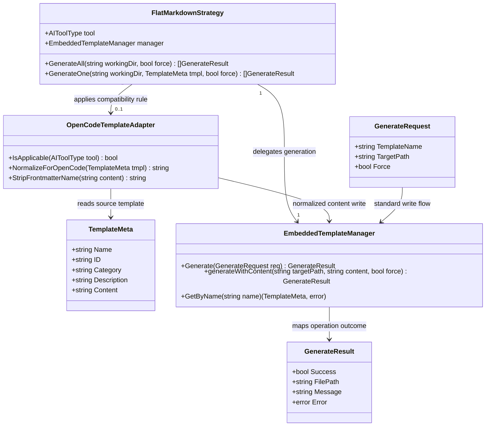

# Fix OpenCode Command Name Resolution in Generated Templates

## Requirements
Implement OpenCode-specific command generation that preserves shared SPDD template reuse while ensuring OpenCode command invocation is determined only by markdown filename, preventing `//spdd-*` command rendering and avoiding regressions in non-OpenCode outputs.

## Entities

## Approach
1. Generation Compatibility Strategy:
   - Add a tool-scoped normalization step in the OpenCode flat markdown generation path.
   - Keep embedded core templates unchanged as the single source of SPDD command content.
   - Remove command-identity-conflicting frontmatter (`name`) only for OpenCode output artifacts.

2. Technical Implementation:
   - Extend the flat generation workflow to support OpenCode-only transformed content write.
   - Preserve existing filename generation (`tmpl.ID + ".md"`) because OpenCode command identity is filename-derived.
   - Maintain current strategy dispatch model (`StrategyFor`) and avoid broad parser/model refactors.
   - Use existing error propagation style in `GenerateResult` and preserve current overwrite safeguards (`--force`) via shared manager write path.

3. Business Logic:
   - Core rule: OpenCode command metadata must not override filename-based command naming.
   - Ensure consistent behavior for both single-template generation and generate-all bulk generation.
   - Preserve backward-compatible behavior for Cursor, Claude Code, Antigravity, GitHub Copilot, and Codex outputs.

## Structure

### Inheritance Relationships
1. `GenerationStrategy` interface defines multi-template and single-template generation contracts.
2. `FlatMarkdownStrategy` implements `GenerationStrategy` for markdown command-file tools.
3. `OpenCodeTemplateAdapter` is a focused compatibility component used by `FlatMarkdownStrategy` when tool is OpenCode.
4. Existing domain errors continue using current error model (`GenerateResult.Error`) without introducing new exception hierarchies.

### Dependencies
1. `cmd/generate.go` calls `templates.StrategyFor(...).GenerateAll/GenerateOne`.
2. `FlatMarkdownStrategy` depends on `EmbeddedTemplateManager` for standard generation and shared content writing.
3. `FlatMarkdownStrategy` depends on `AIToolType` to branch OpenCode normalization behavior and on `OpenCodeTemplateAdapter` for frontmatter transformation.
4. Template tests depend on generated file content contract for OpenCode command files.

### Layered Architecture
1. CLI Layer: resolves active tool, routes generation requests, and reports results.
2. Strategy Layer: applies tool-aware generation behavior and compatibility adaptation.
3. Template Management Layer: resolves embedded templates and manages write operations.
4. Embedded Asset Layer: stores reusable core command markdown templates.
5. Validation/Test Layer: asserts tool-specific output contracts and regression boundaries.

## Operations

### Update Strategy Component - `FlatMarkdownStrategy`
1. Responsibility: apply OpenCode-specific content normalization before writing command files.
2. Attributes:
   - `tool`: `detector.AIToolType` - active tool target controlling compatibility behavior.
   - `manager`: `*EmbeddedTemplateManager` - shared template provider and writer.
3. Methods:
   - `GenerateOne(workingDir string, tmpl TemplateMeta, force bool) []GenerateResult`
     - Logic:
       - Resolve target directory from `tool.GetConfigDir()`.
       - Build target filename as `<tmpl.ID>.md` for all tools.
       - If tool is OpenCode, normalize content via `OpenCodeTemplateAdapter.NormalizeForOpenCode` and write via `EmbeddedTemplateManager.generateWithContent`.
       - If tool is not OpenCode, keep current generation flow unchanged (`GenerateRequest` -> `EmbeddedTemplateManager.Generate`).
       - Return success/failure in existing `GenerateResult` format.
   - `GenerateAll(workingDir string, force bool) []GenerateResult`
     - Logic:
       - List all available templates for active tool.
       - Iterate templates and call the updated `GenerateOne` path so normalization is uniformly applied.
       - Preserve current aggregate result behavior.
4. Annotations: none (Go package-level strategy implementation).
5. Constraints:
   - Do not change behavior for non-OpenCode tools.
   - Do not alter filename mapping logic.

### Create/Update Compatibility Helper - `OpenCodeTemplateAdapter`
1. Responsibility: transform template markdown content to OpenCode-compatible frontmatter.
2. Attributes:
   - stateless adapter implementation (no fields).
3. Methods:
   - `IsApplicable(tool detector.AIToolType) bool`
      - Logic:
        - Return true only when tool equals `detector.OpenCode`.
   - `NormalizeForOpenCode(tmpl TemplateMeta) string`
      - Logic:
        - Delegate to `StripFrontmatterName(tmpl.Content)`.
        - Return transformed markdown ready for file write.
   - `StripFrontmatterName(content string) string`
      - Logic:
        - If content does not start with `---`, return original content.
        - Split content using `strings.SplitN(content, "---", 3)`; if invalid frontmatter shape, return original content.
        - Remove only lines whose trimmed value starts with `name:` from the frontmatter block.
        - Rebuild content with frontmatter delimiters and original markdown body unchanged.
        - Return original content unchanged when no frontmatter is present.
4. Annotations: none.
5. Constraints:
   - Must be idempotent (re-applying should not alter output again).
   - Must not remove `name` occurrences in body text.

### Update Template Write Flow - `EmbeddedTemplateManager`
1. Responsibility: support strategy-provided content writes without breaking existing template lookup APIs.
2. Attributes:
   - existing request/result models remain primary contract.
3. Methods:
   - `generateWithContent(targetPath, content, force) GenerateResult`:
     - enforce overwrite checks (`--force`), create parent directory, and write provided content.
     - return existing `GenerateResult` success/error contract.
   - `Generate(req) GenerateResult`:
     - preserve template lookup semantics.
     - delegate write behavior to `generateWithContent(targetPath, template.Content, req.Force)`.
4. Annotations: none.
5. Constraints:
   - Keep `GetByName` and metadata parsing behavior intact for current tests and command selection.
   - Preserve file existence checks and `--force` semantics.

### Extend Tests - OpenCode Output Contract
1. Responsibility: codify the fix and guard against cross-tool regressions.
2. Attributes:
   - test fixtures for OpenCode target directory and generated markdown snapshots.
3. Methods:
   - `TestFlatMarkdownStrategy_OpenCodeGenerateOne_RemovesFrontmatterName`:
      - file path is `.opencode/commands/<id>.md`
      - frontmatter does not contain `name:` key
      - markdown body remains intact.
   - `TestFlatMarkdownStrategy_OpenCodeGenerateAll_RemovesFrontmatterName`:
     - all generated command files for OpenCode omit `name:`.
   - `TestFlatMarkdownStrategy_NonOpenCode_PreservesFrontmatterName`:
     - non-OpenCode targets (Cursor) preserve `name:`.
   - `TestFlatMarkdownStrategy_OpenCodeForceRegeneration_IsIdempotent`:
     - regeneration with `--force` keeps valid frontmatter delimiters and does not reintroduce `name:`.
4. Annotations: Go `testing` package with table-driven tests consistent with existing style.
5. Constraints:
   - Tests must be deterministic and filesystem-local (`t.TempDir()`).
   - Do not rely on interactive CLI behavior.

### Update Documentation Surface - OpenCode Command Semantics
1. Responsibility: align user expectations with generated output behavior.
2. Attributes:
   - `README.md`, `README.zh-CN.md`, and relevant OpenCode template notes.
3. Methods:
   - Document that OpenCode command invocation uses markdown filename.
   - Document that OpenCode-generated command files intentionally omit frontmatter `name` to avoid command alias conflicts.
4. Annotations: none.
5. Constraints:
   - Keep wording additive and scoped to OpenCode behavior.

## Norms
1. Annotation Standards: keep Go code idiomatic with explicit package boundaries and minimal exported surface.
2. Dependency Injection: continue constructor-free lightweight composition used by strategies and managers.
3. Exception Handling:
   - Preserve current `GenerateResult`-based error propagation pattern.
   - Return actionable error messages for file write or parsing failures.
   - Do not introduce panics for malformed template content.
4. Data Validation: validate frontmatter boundaries before mutation; fallback safely to original content when structure is absent.
5. Logging: keep existing CLI renderer messaging patterns; do not add verbose output in library code.
6. Documentation Standards: update English and Chinese docs together when user-visible behavior changes.
7. Strategy Scope: keep OpenCode adaptation strategy-local (`FlatMarkdownStrategy` + `OpenCodeTemplateAdapter`) and route file writes through shared manager write logic.

## Safeguards
1. Functional Constraints: OpenCode-generated commands must render as `/spdd-*` and must not include frontmatter `name` key in generated files.
2. Performance Constraints: content normalization should be linear in file size and add negligible overhead to batch generation.
3. Security Constraints: no external I/O beyond target generation paths; no execution of template content.
4. Integration Constraints: strategy dispatch remains tool-based and must not alter Copilot or Codex specialized flows.
5. Business Rule Constraints: shared core template source remains unchanged; OpenCode adaptation occurs at generation boundary only.
6. Exception Handling Constraints:
   - All generation failures must return `GenerateResult{Success:false}` with non-nil error.
   - Error messages must not leak unrelated filesystem internals.
   - Partial generation failures in generate-all must be isolated per template.
7. Technical Constraints: avoid changing `TemplateMeta.Name` semantics globally to protect `GetByName("/spdd-*")` compatibility.
8. Data Constraints: only remove top-level frontmatter `name`; preserve `id`, `category`, `description`, and markdown body verbatim.
9. API Constraints: CLI command signatures and flags (`generate`, `--tool`, `--force`) remain backward-compatible.
